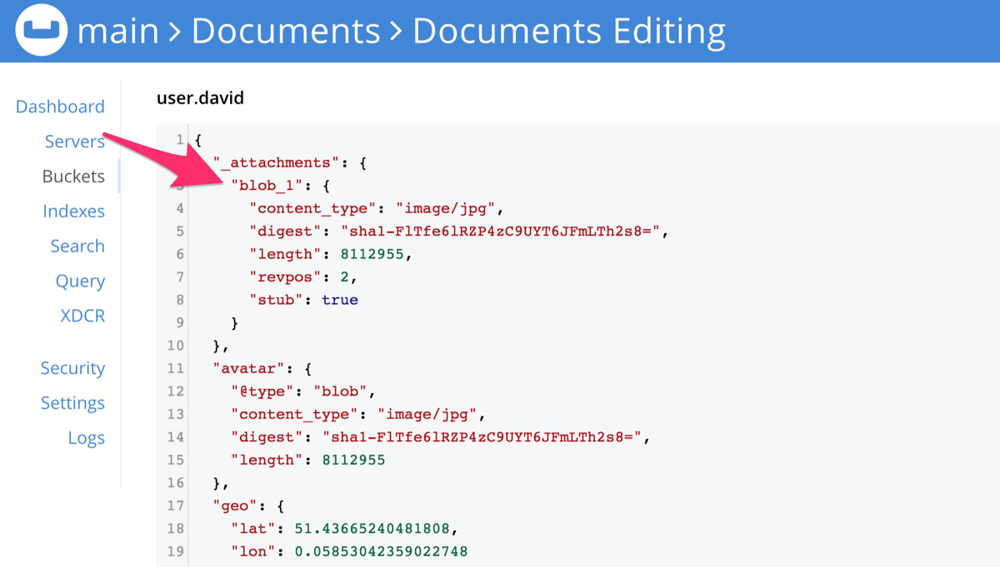

_Couchbase Lite database data model concepts — blobs_

## Introduction

Couchbase Lite uses blobs to store the contents of images, other media files and similar format files as binary objects.

The blob itself is not stored in the document. It is held in a separate content-addressable store indexed from the
document and retrieved only on-demand.

When a document is synchronized, the Couchbase Lite replicator adds an `_attachments` dictionary to the document’s
properties if it contains a blob — see [Figure 1](#figure-1).

## Blob Objects

The blob as an object appears in a document as dictionary property — see, for example _avatar_ in [Figure 1](#figure-1).

Other properties include `length` (the length in bytes), and optionally `content_type` (typically, its MIME type).

The blob’s data (an image, audio or video content) is not stored in the document, but in a separate content-addressable
store, indexed by the digest property — see [Using Blobs](#using-blobs).

### Constraints

* **Couchbase Lite**  
  Blobs can be arbitrarily large. They are only read on demand, not when you load a _document_.
* **Sync Gateway**  
  The maximum content size is 20 MB per blob. If a document’s blob is over 20 MB, the document will be replicated but
  not the blob.

## Using Blobs

The Blob API lets you access the blob’s data content as in-memory data (a `ByteArray`) or as a `Source` input stream.

The code in [Example 1](#example-1) shows how you might add a blob to a document and save it to the database. Here we
use _avatar_ as the property key and a jpeg file as the blob data.

!!! example "<span id='example-1'>Example 1. Working with blobs</span>"

    ```kotlin
    // kotlinx-io multiplatform file system APIs are still in development
    // However, platform-specific implementations can be created in the meantime
    expect fun getAsset(file: String): Source?
    
    val mDoc = MutableDocument()
    
    getAsset("avatar.jpg")?.use { source ->
      mDoc.setBlob("avatar", Blob("image/jpeg", source))
      database.save(mDoc)
    }
    
    val doc = database.getDocument(mDoc.id)
    val bytes = doc?.getBlob("avatar")?.content
    ```

1. Prepare a document to use for the example.
2. Create the blob using the retrieved image and set `image/jpg` as the blob MIME type.
3. Add the blob to a document, using `avatar` as the property key.
4. Saving the document generates a random access key for each blob stored in `digest` a SHA-1 encrypted property — see
   [Figure 1](#figure-1).
5. Use the `avatar` key to retrieve the blob object later. Note, this is the identity of the blob assigned by us; the
   replication auto-generates a blob for attachments and assigns its own name to it (for example, `blob_1`) — see
   [Figure 1](#figure-1). The `digest` key will be the same as generated when we saved the blob document.

## Syncing

When a document containing a blob object is synchronized, the Couchbase Lite replicator generates an `_attachments`
dictionary with an auto-generated name for each blob attachment. This is different to the `avatar` key and is used
internally to access the blob content.

If you view a sync’ed blob document in Couchbase Server Admin Console, you will see something similar to [Figure
1](#figure-1), which shows the document with its generated `_attachments` dictionary, including the `digest`.

<figure markdown id='figure-1'>
  { loading=lazy }
  <figcaption>Figure 1. Sample Blob Document</figcaption>
</figure>
