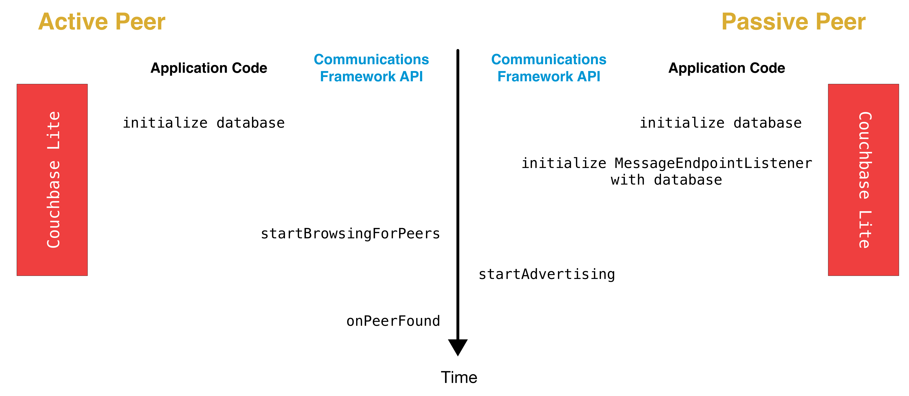
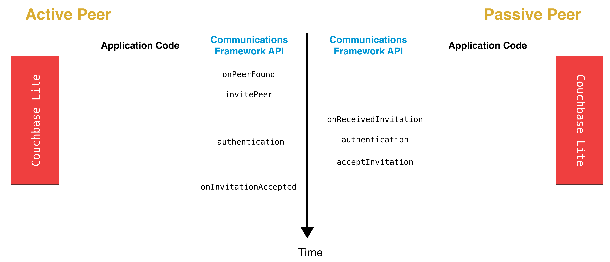
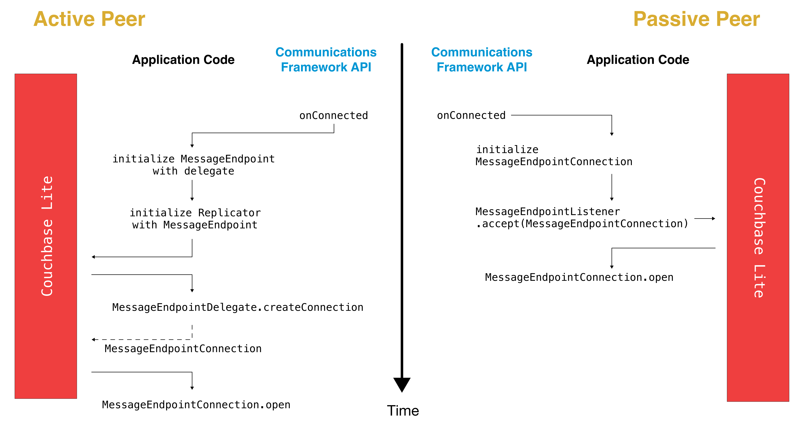
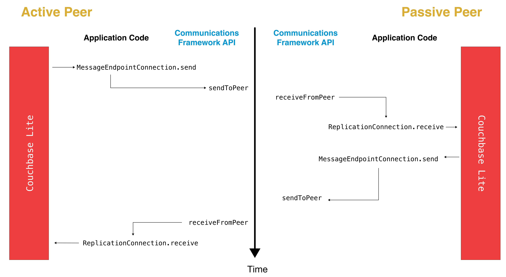
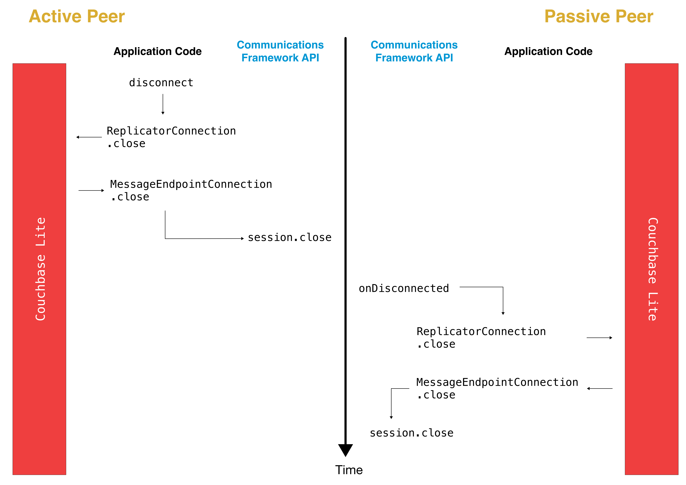
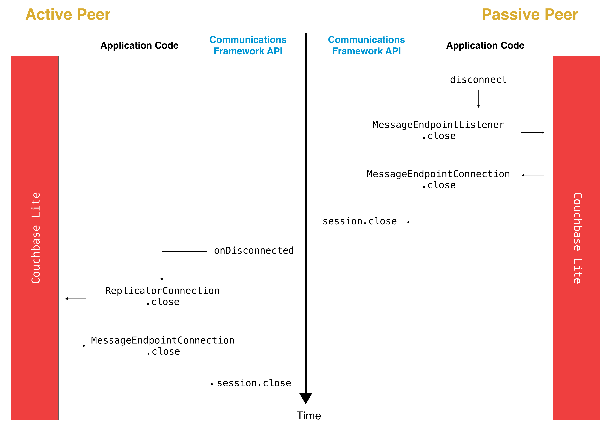

_Couchbase Lite database peer-to-peer sync — integrate a custom-built listener_

## Overview

!!! important "This is an [Enterprise Edition](https://www.couchbase.com/products/editions) feature."

This content covers how to integrate a custom [`MessageEndpointListener`](
/api/couchbase-lite-ee/kotbase/-message-endpoint-listener/) solution with Couchbase Lite to handle the data transfer,
which is the sending and receiving of data. Where applicable, we discuss how to integrate Couchbase Lite into the
workflow.

The following sections describe a typical Peer-to-Peer workflow.

## Peer Discovery

Peer discovery is the first step. The communication framework will generally include a peer discovery API for devices to
advertise themselves on the network and to browse for other peers.

{ loading=lazy }

### Active Peer

The first step is to initialize the Couchbase Lite database.

### Passive Peer

In addition to initializing the database, the Passive Peer must initialize the [`MessageEndpointListener`](
/api/couchbase-lite-ee/kotbase/-message-endpoint-listener/). The [`MessageEndpointListener`](
/api/couchbase-lite-ee/kotbase/-message-endpoint-listener/) acts as a listener for incoming connections.

```kotlin
listener = MessageEndpointListener(
    MessageEndpointListenerConfigurationFactory.newConfig(database, ProtocolType.MESSAGE_STREAM)
)
```

## Peer Selection and Connection Setup

Once a peer device is found, the application code must decide whether it should establish a connection with that peer.
This step includes inviting a peer to a session and peer authentication.

This is handled by the Communication Framework.

{ loading=lazy }

Once the remote peer has been authenticated, the next step is to connect with that peer and initialize the
[`MessageEndpoint`](/api/couchbase-lite-ee/kotbase/-message-endpoint/) API.

## Replication Setup

{ loading=lazy }

### Active Peer

When the connection is established, the Active Peer must instantiate a [`MessageEndpoint`](
/api/couchbase-lite-ee/kotbase/-message-endpoint/) object corresponding to the remote peer.

```kotlin
// The delegate must implement the `MessageEndpointDelegate` protocol.
val messageEndpoint = MessageEndpoint("UID:123", "active", ProtocolType.MESSAGE_STREAM, delegate)
```

The [`MessageEndpoint`](/api/couchbase-lite-ee/kotbase/-message-endpoint/-message-endpoint.html) constructor takes the
following arguments:

1. `uid`: A unique ID that represents the remote Active Peer.
2. `target`: This represents the remote Passive Peer and could be any suitable representation of the remote peer. It
   could be an ID, URL, etc. If using the [Multipeer Connectivity Framework](
   https://developer.apple.com/documentation/multipeerconnectivity), this could be the [`MCPeerID`](
   https://developer.apple.com/documentation/multipeerconnectivity/mcpeerid?language=objc).
3. `protocolType`: Specifies the kind of transport you intend to implement. There are two options:
    * The default (`MESSAGE_STREAM`) means that you want to "send a series of messages", or in other words the
      Communication Framework will control the formatting of messages so that there are clear boundaries between
      messages.
    * The alternative (`BYTE_STREAM`) means that you just want to send raw bytes over the stream and Couchbase should
      format for you to ensure that messages get delivered in full.<br><br>
      Typically, the Communication Framework will handle message assembly and disassembly, so you would use the
      `MESSAGE_STREAM` option in most cases.
4. `delegate`: The delegate that will implement the [`MessageEndpointDelegate`](
   /api/couchbase-lite-ee/kotbase/index.html#1493885694%2FClasslikes%2F-848713996) protocol, which is a factory for
   [`MessageEndpointConnection`](/api/couchbase-lite-ee/kotbase/-message-endpoint-connection/).

Then, a [`Replicator`](/api/couchbase-lite-ee/kotbase/-replicator/) is instantiated with the initialized
[`MessageEndpoint`](/api/couchbase-lite-ee/kotbase/-message-endpoint/) as the target.

```kotlin
// Create the replicator object.
val repl = Replicator(
    ReplicatorConfigurationFactory.newConfig(
        database = database,
        target = messageEndpoint
    )
)

// Start the replication.
repl.start()
this.replicator = repl
```

Next, Couchbase Lite will call back the application code through the [`MessageEndpointDelegate`](
/api/couchbase-lite-ee/kotbase/index.html#1493885694%2FClasslikes%2F-848713996) lambda. When the application receives
the callback, it must create an instance of [`MessageEndpointConnection`](
/api/couchbase-lite-ee/kotbase/-message-endpoint-connection/) and return it.

```kotlin
/* implementation of MessageEndpointDelegate */
val delegate: MessageEndpointDelegate = { endpoint ->
    ActivePeerConnection()
}
```

Next, Couchbase Lite will call back the application code through the [`MessageEndpointConnection.open()`](
/api/couchbase-lite-ee/kotbase/-message-endpoint-connection/open.html) method.

```kotlin
/* implementation of MessageEndpointConnection */
override fun open(connection: ReplicatorConnection, completion: MessagingCompletion) {
    replicatorConnection = connection
    completion(true, null)
}
```

The connection argument is then set on an instance variable. The application code must keep track of every
[`ReplicatorConnection`](/api/couchbase-lite-ee/kotbase/-replicator-connection/) associated with every
[`MessageEndpointConnection`](/api/couchbase-lite-ee/kotbase/-message-endpoint-connection/).

The [`MessageError`](/api/couchbase-lite-ee/kotbase/-messaging-error/) argument in the completion block specifies
whether the error is recoverable or not. If it is a recoverable error, the replicator will begin a retry process,
creating a new [`MessageEndpointConnection`](/api/couchbase-lite-ee/kotbase/-message-endpoint-connection/) instance.

### Passive Peer

After connection establishment on the Passive Peer, the first step is to initialize a new [`MessageEndpointConnection`](
/api/couchbase-lite-ee/kotbase/-message-endpoint-connection/) and pass it to the listener. This message tells the
listener to accept incoming data from that peer.

```kotlin
/* implements MessageEndpointConnection */
val connection = PassivePeerConnection()
listener?.accept(connection)
```

`listener` is the instance of the [`MessageEndpointListener`](
/api/couchbase-lite-ee/kotbase/-message-endpoint-listener/) that was created in the first step ([Peer Discovery
](#peer-discovery)).

Couchbase Lite will call the application code back through the [`MessageEndpointConnection.open()`](
/api/couchbase-lite-ee/kotbase/-message-endpoint-connection/open.html) method.

```kotlin
/* implementation of MessageEndpointConnection */
override fun open(connection: ReplicatorConnection, completion: MessagingCompletion) {
    replicatorConnection = connection
    completion(true, null)
}
```

The connection argument is then set on an instance variable. The application code must keep track of every
[`ReplicatorConnection`](/api/couchbase-lite-ee/kotbase/-replicator-connection/) associated with every
[`MessageEndpointConnection`](/api/couchbase-lite-ee/kotbase/-message-endpoint-connection/).

At this point, the connection is established, and both peers are ready to exchange data.

## Push/Pull Replication

Typically, an application needs to send data and receive data. The directionality of the replication could be any of the
following:

* **Push only:** The data is pushed from the local database to the remote database.
* **Pull only:** The data is pulled from the remote database to the local database.
* **Push and Pull:** The data is exchanged both ways.

Usually, the remote is a Sync Gateway database identified through a URL. In Peer-to-Peer syncing, the remote is another
Couchbase Lite database.

{ loading=lazy }

The replication lifecycle is handled through the [`MessageEndpointConnection`](
/api/couchbase-lite-ee/kotbase/-message-endpoint-connection/).

### Active Peer

When Couchbase Lite calls back the application code through the [`MessageEndpointConnection.send()`](
/api/couchbase-lite-ee/kotbase/-message-endpoint-connection/send.html) method, you should send that data to the other
peer using the Communication Framework.

```kotlin
/* implementation of MessageEndpointConnection */
override fun send(message: Message, completion: MessagingCompletion) {
    /* send the data to the other peer */
    /* ... */
    /* call the completion handler once the message is sent */
    completion(true, null)
}
```

Once the data is sent, call the completion block to acknowledge the completion. You can use the [`MessageError`](
/api/couchbase-lite-ee/kotbase/-messaging-error/) in the completion block to specify whether the error is recoverable.
If it is a recoverable error, the replicator will begin a retry process, creating a new [`MessageEndpointConnection`](
/api/couchbase-lite-ee/kotbase/-message-endpoint-connection/).

When data is received from the Passive Peer via the Communication Framework, you call the
[`ReplicatorConnection.receive()`](/api/couchbase-lite-ee/kotbase/-replicator-connection/receive.html) method.

```kotlin
replicatorConnection?.receive(message)
```

The [`ReplicatorConnection`](/api/couchbase-lite-ee/kotbase/-replicator-connection/)’s [`receive()`](
/api/couchbase-lite-ee/kotbase/-replicator-connection/receive.html) method is called. Which then processes the data to
persist to the local database.

### Passive Peer

As in the case of the Active Peer, the Passive Peer must implement the [`MessageEndpointConnection.send()`](
/api/couchbase-lite-ee/kotbase/-message-endpoint-connection/send.html) method to send data to the other peer.

```kotlin
/* implementation of MessageEndpointConnection */
override fun send(message: Message, completion: MessagingCompletion) {
    /* send the data to the other peer */
    /* ... */
    /* call the completion handler once the message is sent */
    completion(true, null)
}
```

Once the data is sent, call the completion block to acknowledge the completion. You can use the [`MessageError`](
/api/couchbase-lite-ee/kotbase/-messaging-error/) in the completion block to specify whether the error is recoverable.
If it is a recoverable error, the replicator will begin a retry process, creating a new [`MessageEndpointConnection`](
/api/couchbase-lite-ee/kotbase/-message-endpoint-connection/).

When data is received from the Active Peer via the Communication Framework, you call the
[`ReplicatorConnection.receive()`](/api/couchbase-lite-ee/kotbase/-replicator-connection/receive.html) method.

```kotlin
replicatorConnection?.receive(message)
```

## Connection Teardown

When a peer disconnects from a peer-to-peer network, all connected peers are notified. The disconnect notification is a
good opportunity to close and remove a replication connection. The steps to tear down the connection are slightly
different depending on whether the active or passive peer disconnects first. We will cover each case below.

### Initiated by Active Peer

{ loading=lazy }

#### Active Peer

When an Active Peer disconnects, it must call the [`ReplicatorConnection.close()`](
/api/couchbase-lite-ee/kotbase/-replicator-connection/close.html) method.

```kotlin
fun disconnect() {
    replicatorConnection?.close(null)
    replicatorConnection = null
}
```

Then, Couchbase Lite will call back your code through the [`MessageEndpointConnection.close()`](
/api/couchbase-lite-ee/kotbase/-message-endpoint-connection/close.html) to allow the application to disconnect with the
Communication Framework.

```kotlin
override fun close(error: Exception?, completion: MessagingCloseCompletion) {
    /* disconnect with communications framework */
    /* ... */
    /* call completion handler */
    completion()
}
```

#### Passive Peer

When the Passive Peer receives the corresponding disconnect notification from the Communication Framework, it must call
the [`ReplicatorConnection.close()`](/api/couchbase-lite-ee/kotbase/-replicator-connection/close.html) method.

```kotlin
replicatorConnection?.close(null)
```

Then, Couchbase Lite will call back your code through the [`MessageEndpointConnection.close()`](
/api/couchbase-lite-ee/kotbase/-message-endpoint-connection/close.html) to allow the application to disconnect with the
Communication Framework.

```kotlin
/* implementation of MessageEndpointConnection */
override fun close(error: Exception?, completion: MessagingCloseCompletion) {
    /* disconnect with communications framework */
    /* ... */
    /* call completion handler */
    completion()
}
```

### Initiated by Passive Peer

{ loading=lazy }

#### Passive Peer

When the Passive Peer disconnects, it must class the [`MessageEndpointListener.closeAll()`](
/api/couchbase-lite-ee/kotbase/-message-endpoint-listener/close-all.html) method.

```kotlin
listener?.closeAll()
```

Then, Couchbase Lite will call back your code through the [`MessageEndpointConnection.close()`](
/api/couchbase-lite-ee/kotbase/-message-endpoint-connection/close.html) to allow the application to disconnect with the
Communication Framework.

```kotlin
/* implementation of MessageEndpointConnection */
override fun close(error: Exception?, completion: MessagingCloseCompletion) {
    /* disconnect with communications framework */
    /* ... */
    /* call completion handler */
    completion()
}
```

#### Active Peer

When the Active Peer receives the corresponding disconnect notification from the Communication Framework, it must call
the [`ReplicatorConnection.close()`](/api/couchbase-lite-ee/kotbase/-replicator-connection/close.html) method.

```kotlin
fun disconnect() {
    replicatorConnection?.close(null)
    replicatorConnection = null
}
```

Then, Couchbase Lite will call back your code through the [`MessageEndpointConnection.close()`](
/api/couchbase-lite-ee/kotbase/-message-endpoint-connection/close.html) to allow the application to disconnect with the
Communication Framework.

```kotlin
override fun close(error: Exception?, completion: MessagingCloseCompletion) {
    /* disconnect with communications framework */
    /* ... */
    /* call completion handler */
    completion()
}
```
