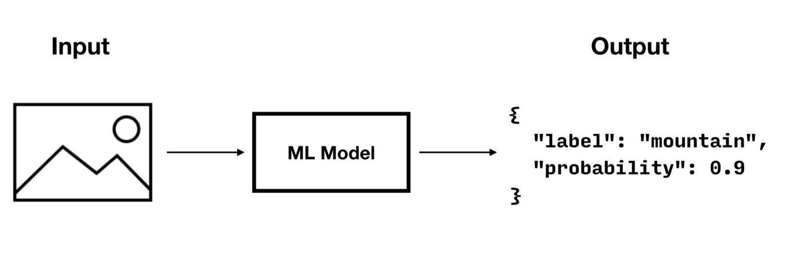

_How to use `QueryBuilder` to build effective queries with Kotbase_

!!! note

    The examples used here are based on the _Travel Sample_ app and data introduced in the [Couchbase Mobile Workshop](
    https://docs.couchbase.com/tutorials/mobile-travel-tutorial/introduction.html) tutorial.

## Introduction

Kotbase provides two ways to build and run database queries; the `QueryBuilder` API described in this topic and [SQL++
for Mobile](sql++-for-mobile.md).

Database queries defined with the `QueryBuilder` API use the query statement format shown in [Example 1](#example-1).
The structure and semantics of the query format are based on Couchbase’s [SQL++ query language](
https://docs.couchbase.com/server/current/learn/data/n1ql-versus-sql.html).

!!! example "<span id='example-1'>Example 1. Query Format</span>"

    ```sql
    SELECT ____
    FROM 'data-source'
    WHERE ____,
    JOIN ____
    GROUP BY ____
    ORDER BY ____
    ```

**Query Components**

| Component                                 | Description                                                                                                            |
|:------------------------------------------|:-----------------------------------------------------------------------------------------------------------------------|
| [SELECT statement](#select-statement)     | The document properties that will be returned in the result set                                                        |
| FROM                                      | The data source to query the documents from - the collection of the database.                                          |
| [WHERE statement](#where-statement)       | The query criteria<br>The `SELECT`ed properties of documents matching this criteria will be returned in the result set |
| [JOIN statement](#join-statement)         | The criteria for joining multiple documents                                                                            |
| [GROUP BY statement](#groub-by-statement) | The criteria used to group returned items in the result set                                                            |
| [ORDER BY statement](#order-by-statement) | The criteria used to order the items in the result set                                                                 |

!!! tip

    We recommend working through the query section of the [Couchbase Mobile Workshop](
    https://docs.couchbase.com/tutorials/mobile-travel-tutorial/introduction.html) tutorial as a good way to build your
    skills in this area.

## SELECT statement

**In this section**  
[Return All Properties](#return-all-properties) | [Return Selected Properties](#return-selected-properties)   

**Related**
[Result Sets](#result-sets)

Use the `SELECT` statement to specify which properties you want to return from the queried documents. You can opt to
retrieve entire documents, or just the specific properties you need.

### Return All Properties

Use the `SelectResult.all()` method to return all the properties of selected documents — see [Example 2](#example-2).

!!! example "<span id='example-2'>Example 2. Using SELECT to Retrieve All Properties</span>"

    This query shows how to retrieve all properties from all documents in your database.

    ```kotlin
    val queryAll = QueryBuilder
        .select(SelectResult.all())
        .from(DataSource.database(database))
        .where(Expression.property("type").equalTo(Expression.string("hotel")))
    ```

The `Query.execute()` statement returns the results in a dictionary, where the key is the database name — see [Example
3](#example-3).

!!! example "<span id='example-3'>Example 3. ResultSet Format from SelectResult.all()</span>"

    ```json
    [
      {
        "travel-sample": { // The result for the first document matching the query criteria.
          "callsign": "MILE-AIR",
          "country": "United States",
          "iata": "Q5",
          "icao": "MLA",
          "id": 10,
          "name": "40-Mile Air",
          "type": "airline"
        }
      },
      {
        "travel-sample": { // The result for the next document matching the query criteria.
          "callsign": "ALASKAN-AIR",
          "country": "United States",
          "iata": "AA",
          "icao": "AAA",
          "id": 10,
          "name": "Alaskan Airways",
          "type": "airline"
        }
      }
    ]
    ```

See [Result Sets](#result-sets) for more on processing query results.

### Return Selected Properties

To access only specific properties, specify a comma-separated list of `SelectResult` expressions, one for each property,
in the select statement of your query — see [Example 4](#example-4).

!!! example "<span id='example-4'>Example 4. Using SELECT to Retrieve Specific Properties</span>"

    In this query we retrieve and then print the `_id`, `type`, and `name` properties of each document.

    ```kotlin
    val query = QueryBuilder
        .select(
            SelectResult.expression(Meta.id),
            SelectResult.property("name"),
            SelectResult.property("type")
        )
        .from(DataSource.database(database))
        .where(Expression.property("type").equalTo(Expression.string("hotel")))
        .orderBy(Ordering.expression(Meta.id))
    
    query.execute().use { rs ->
        rs.forEach {
            println("hotel id -> ${it.getString("id")}")
            println("hotel name -> ${it.getString("name")}")
        }
    }
    ```

The `Query.execute()` statement returns one or more key-value pairs, one for each `SelectResult` expression, with the
property-name as the key — see [Example 5](#example-5).

!!! example "<span id='example-5'>Example 5. Select Result Format</span>"

    ```json
    [
      { // The result for the first document matching the query criteria.
        "id": "hotel123",
        "type": "hotel",
        "name": "Hotel Ghia"
      },
      { // The result for the next document matching the query criteria.
        "id": "hotel456",
        "type": "hotel",
        "name": "Hotel Deluxe"
      }
    ]
    ```

See [Result Sets](#result-sets) for more on processing query results.

## WHERE statement

**In this section**  
[Comparison Operators](#comparison-operators) | [Collection Operators](#collection-operators) | [Like
Operator](#like-operator) | [Regex Operator](#regex-operator) | [Deleted Document](#deleted-document)

Like SQL, you can use the `WHERE` statement to choose which documents are returned by your query. The `where()`
statement takes in an `Expression`. You can chain any number of `Expression`s in order to implement sophisticated
filtering capabilities.

### Comparison Operators

The [`Expression` Comparators](/api/couchbase-lite-ee/kotbase/-expression/) can be used in the `WHERE` statement to
specify on which property to match documents. In the example below, we use the `equalTo` operator to query documents
where the `type` property equals "hotel".

```json
[
  { 
    "id": "hotel123",
    "type": "hotel",
    "name": "Hotel Ghia"
  },
  { 
    "id": "hotel456",
    "type": "hotel",
    "name": "Hotel Deluxe"
  }
]
```

!!! example "Example 6. Using Where"

    ```kotlin
    val query = QueryBuilder
        .select(SelectResult.all())
        .from(DataSource.database(database))
        .where(Expression.property("type").equalTo(Expression.string("hotel")))
        .limit(Expression.intValue(10))
    
    query.execute().use { rs ->
        rs.forEach { result ->
            result.getDictionary("myDatabase")?.let {
                println("name -> ${it.getString("name")}")
                println("type -> ${it.getString("type")}")
            }
        }
    }
    ```

### Collection Operators

[`ArrayFunction` Collection Operators](/api/couchbase-lite-ee/kotbase/-array-function/) are useful to check if a given
value is present in an array.

#### CONTAINS Operator

The following example uses the [`ArrayFunction`](/api/couchbase-lite-ee/kotbase/-array-function/) to find documents
where the `public_likes` array property contains a value equal to "Armani Langworth".

```json
{
    "_id": "hotel123",
    "name": "Apple Droid",
    "public_likes": ["Armani Langworth", "Elfrieda Gutkowski", "Maureen Ruecker"]
}
```

```kotlin
val query = QueryBuilder
    .select(
        SelectResult.expression(Meta.id),
        SelectResult.property("name"),
        SelectResult.property("public_likes")
    )
    .from(DataSource.database(database))
    .where(
        Expression.property("type").equalTo(Expression.string("hotel"))
            .and(
                ArrayFunction.contains(
                    Expression.property("public_likes"),
                    Expression.string("Armani Langworth")
                )
            )
    )
query.execute().use { rs ->
    rs.forEach {
        println("public_likes -> ${it.getArray("public_likes")?.toList()}")
    }
}
```

#### IN Operator

The `IN` operator is useful when you need to explicitly list out the values to test against. The following example looks
for documents whose `first`, `last`, or `username` property value equals "Armani".

```kotlin
val query = QueryBuilder.select(SelectResult.all())
    .from(DataSource.database(database))
    .where(
        Expression.string("Armani").`in`(
            Expression.property("first"),
            Expression.property("last"),
            Expression.property("username")
        )
    )

query.execute().use { rs ->
    rs.forEach {
        println("public_likes -> ${it.toMap()}")
    }
}
```

### Like Operator

**In this section**  
[String Matching](#string-matching) | [Wildcard Match](#wildcard-match) | [Wildcard Character Match](#wildcard-character-match)

#### String Matching

The [`like()`](/api/couchbase-lite-ee/kotbase/-expression/like.html) operator can be used for string matching — see
[Example 7](#example-7).

!!! note

    The `like` operator performs case sensitive matches.  
    To perform case insensitive matching, use `Function.lower` or `Function.upper` to ensure all comparators have the
    same case, thereby removing the case issue.

This query returns `landmark` type documents where the `name` matches the string "Royal Engineers Museum", regardless of
how it is capitalized (so, it selects "royal engineers museum", "ROYAL ENGINEERS MUSEUM" and so on).

!!! example "<span id='example-7'>Example 7. Like with case-insensitive matching</span>"

    ```kotlin
    val query = QueryBuilder
        .select(
            SelectResult.expression(Meta.id),
            SelectResult.property("country"),
            SelectResult.property("name")
        )
        .from(DataSource.database(database))
        .where(
            Expression.property("type").equalTo(Expression.string("landmark"))
                .and(
                    Function.lower(Expression.property("name"))
                        .like(Expression.string("royal engineers museum"))
                )
        )
    query.execute().use { rs ->
        rs.forEach {
            println("name -> ${it.getString("name")}")
        }
    }
    ```

**Note** the use of `Function.lower()` to transform `name` values to the same case as the literal comparator.

#### Wildcard Match

We can use `%` sign within a `like` expression to do a wildcard match against zero or more characters. Using wildcards
allows you to have some fuzziness in your search string.

In [Example 8](#example-8) below, we are looking for documents of `type` "landmark" where the name property matches any
string that begins with "eng" followed by zero or more characters, the letter "e", followed by zero or more characters.
Once again, we are using `Function.lower()` to make the search case insensitive.

So the query returns "landmark" documents with names such as "Engineers", "engine", "english egg" and "England Eagle".
Notice that the matches may span word boundaries.

!!! example "<span id='example-8'>Example 8. Wildcard Matches</span>"

    ```kotlin
    val query = QueryBuilder
        .select(
            SelectResult.expression(Meta.id),
            SelectResult.property("country"),
            SelectResult.property("name")
        )
        .from(DataSource.database(database))
        .where(
            Expression.property("type").equalTo(Expression.string("landmark"))
                .and(
                    Function.lower(Expression.property("name"))
                        .like(Expression.string("eng%e%"))
                )
        )
    query.execute().use { rs ->
        rs.forEach {
            println("name -> ${it.getString("name")}")
        }
    }
    ```

#### Wildcard Character Match

We can use an `_` sign within a `like` expression to do a wildcard match against a single character.

In [Example 9](#example-9) below, we are looking for documents of type "landmark" where the `name` property matches any
string that begins with "eng" followed by exactly 4 wildcard characters and ending in the letter "r". The query returns
"landmark" type documents with names such as "Engineer", "engineer" and so on.

!!! example "<span id='example-9'>Example 9. Wildcard Character Matching</span>"

    ```kotlin
    val query = QueryBuilder
        .select(
            SelectResult.expression(Meta.id),
            SelectResult.property("country"),
            SelectResult.property("name")
        )
        .from(DataSource.database(database))
        .where(
            Expression.property("type").equalTo(Expression.string("landmark"))
                .and(
                    Function.lower(Expression.property("name"))
                        .like(Expression.string("eng____r"))
                )
        )
    query.execute().use { rs ->
        rs.forEach {
            println("name -> ${it.getString("name")}")
        }
    }
    ```

### Regex Operator

Similar to the wildcards in `like` expressions, `regex` based pattern matching allow you to introduce an element of
fuzziness in your search string — see the code shown in [Example 10](#example-10).

!!! note

    The regex operator is case sensitive, use `upper` or `lower` functions to mitigate this if required.

!!! example "<span id='example-10'>Example 10. Using Regular Expressions</span>"

    This example returns documents with a `type` of "landmark" and a `name` property that matches any string that begins
    with "eng" and ends in the letter "e".

    ```kotlin
    val query = QueryBuilder
        .select(
            SelectResult.expression(Meta.id),
            SelectResult.property("country"),
            SelectResult.property("name")
        )
        .from(DataSource.database(database))
        .where(
            Expression.property("type").equalTo(Expression.string("landmark"))
                .and(
                    Function.lower(Expression.property("name"))
                        .regex(Expression.string("\\beng.*r\\b"))
                )
        )
    query.execute().use { rs ->
        rs.forEach {
            println("name -> ${it.getString("name")}")
        }
    }
    ```

    The `\b` specifies that the match must occur on word boundaries.

!!! tip

    For more on the regex spec used by Couchbase Lite see [cplusplus regex reference page](
    http://www.cplusplus.com/reference/regex/ECMAScript/).

### Deleted Document

You can query documents that have been deleted (tombstones) as shown in [Example 11](#example-11).

!!! example "<span id='example-11'>Example 11. Query to select Deleted Documents</span>"

    This example shows how to query deleted documents in the database. It returns is an array of key-value pairs.

    ```kotlin
    // Query documents that have been deleted
    val query = QueryBuilder
        .select(SelectResult.expression(Meta.id))
        .from(DataSource.database(database))
        .where(Meta.deleted)
    ```

## JOIN statement

The `JOIN` clause enables you to select data from multiple documents that have been linked by criteria specified in the
`JOIN` statement. For example to combine airline details with route details, linked by the airline id — see [Example
12](#example-12).

!!! example "<span id='example-12'>Example 12. Using JOIN to Combine Document Details</span>"

    This example JOINS the document of `type` "route" with documents of `type` "airline" using the document ID (`_id`)
    on the _airline_ document and `airlineid` on the _route_ document.

    ```kotlin
    val query = QueryBuilder
        .select(
            SelectResult.expression(Expression.property("name").from("airline")),
            SelectResult.expression(Expression.property("callsign").from("airline")),
            SelectResult.expression(Expression.property("destinationairport").from("route")),
            SelectResult.expression(Expression.property("stops").from("route")),
            SelectResult.expression(Expression.property("airline").from("route"))
        )
        .from(DataSource.database(database).`as`("airline"))
        .join(
            Join.join(DataSource.database(database).`as`("route"))
                .on(
                    Meta.id.from("airline")
                        .equalTo(Expression.property("airlineid").from("route"))
                )
        )
        .where(
            Expression.property("type").from("route").equalTo(Expression.string("route"))
                .and(
                    Expression.property("type").from("airline")
                        .equalTo(Expression.string("airline"))
                )
                .and(
                    Expression.property("sourceairport").from("route")
                        .equalTo(Expression.string("RIX"))
                )
        )
    query.execute().use { rs ->
        rs.forEach {
            println("name -> ${it.toMap()}")
        }
    }
    ```

## GROUP BY statement

You can perform further processing on the data in your result set before the final projection is generated.

The following example looks for the number of airports at an altitude of 300 ft or higher and groups the results by
country and timezone.

```json title="Data Model for Example"
{
    "_id": "airport123",
    "type": "airport",
    "country": "United States",
    "geo": { "alt": 456 },
    "tz": "America/Anchorage"
}
```

!!! example "<span id='example-13'>Example 13. Query using GroupBy</span>"

    This example shows a query that selects all airports with an altitude above 300ft. The output (a count, $1) is
    grouped by country, within timezone.

    ```kotlin
    val query = QueryBuilder
        .select(
            SelectResult.expression(Function.count(Expression.string("*"))),
            SelectResult.property("country"),
            SelectResult.property("tz")
        )
        .from(DataSource.database(database))
        .where(
            Expression.property("type").equalTo(Expression.string("airport"))
                .and(Expression.property("geo.alt").greaterThanOrEqualTo(Expression.intValue(300)))
        )
        .groupBy(
            Expression.property("country"), Expression.property("tz")
        )
        .orderBy(Ordering.expression(Function.count(Expression.string("*"))).descending())
    query.execute().use { rs ->
        rs.forEach {
            println(
                "There are ${it.getInt("$1")} airports on the ${
                    it.getString("tz")
                } timezone located in ${
                    it.getString("country")
                } and above 300ft"
            )
        }
    }
    ```

The query shown in [Example 13](#example-13) generates the following output:

> There are 138 airports on the Europe/Paris timezone located in France and above 300 ft  
> There are 29 airports on the Europe/London timezone located in United Kingdom and above 300 ft  
> There are 50 airports on the America/Anchorage timezone located in United States and above 300 ft  
> There are 279 airports on the America/Chicago timezone located in United States and above 300 ft  
> There are 123 airports on the America/Denver timezone located in United States and above 300 ft

## ORDER BY statement

It is possible to sort the results of a query based on a given expression result — see [Example 14](#example-14).

!!! example "<span id='example-14'>Example 14. Query using OrderBy</span>"

    This example shows a query that returns documents of `type` equal to "hotel" sorted in ascending order by the value
    of the `title` property.

    ```kotlin
    val query = QueryBuilder
        .select(
            SelectResult.expression(Meta.id),
            SelectResult.property("name")
        )
        .from(DataSource.database(database))
        .where(Expression.property("type").equalTo(Expression.string("hotel")))
        .orderBy(Ordering.property("name").ascending())
        .limit(Expression.intValue(10))
    
    query.execute().use { rs ->
        rs.forEach {
            println("${it.toMap()}")
        }
    }
    ```

The query shown in [Example 14](#example-14) generates the following output:

> Aberdyfi  
> Achiltibuie  
> Altrincham  
> Ambleside  
> Annan  
> Ardèche  
> Armagh  
> Avignon

## Date/Time Functions

Couchbase Lite documents support a date type that internally stores dates in ISO 8601 with the GMT/UTC timezone.

Couchbase Lite’s Query Builder API includes four functions for date comparisons.

`Function.stringToMillis(Expression.property("date_time"))`  
The input to this will be a validly formatted ISO 8601 `date_time` string. The end result will be an expression (with a
numeric content) that can be further input into the query builder.

`Function.stringToUTC(Expression.property("date_time"))`  
The input to this will be a validly formatted ISO 8601 `date_time` string. The end result will be an expression (with
string content) that can be further input into the query builder.

`Function.millisToString(Expression.property("date_time"))`  
The input for this is a numeric value representing milliseconds since the Unix epoch. The end result will be an
expression (with string content representing the date and time as an ISO 8601 string in the device’s timezone) that can
be further input into the query builder.

`Function.millisToUTC(Expression.property("date_time"))`  
The input for this is a numeric value representing milliseconds since the Unix epoch. The end result will be an
expression (with string content representing the date and time as a UTC ISO 8601 string) that can be further input into
the query builder.

## Result Sets

**In this section**  
[Processing](#processing) | [Select All Properties](#select-all-properties) | [Select Specific
Properties](#select-specific-properties) | [Select Document ID Only](#select-document-id-only) | [Select
Count-only](#select-count-only) | [Handling Pagination](#handling-pagination)

### Processing

This section shows how to handle the returned result sets for different types of `SELECT` statements.

The result set format and its handling varies slightly depending on the type of `SelectResult` statements used. The
result set formats you may encounter include those generated by:

* `SelectResult.all()` — see [All Properties](#select-all-properties)
* `SelectResult.property("name")` — see [Specific Properties](#select-specific-properties)
* `SelectResult.expression(Meta.id)` — Metadata (such as the `_id`) — see [Document ID Only](#select-document-id-only)
* `SelectResult.expression(Function.count(Expression.all())).as("mycount")` — see [Select
  Count-only](#select-count-only)

To process the results of a query, you first need to execute it using `Query.execute()`.

The execution of a Kotbase database query typically returns an array of results, a result set.

* The result set of an aggregate, count-only, query is a key-value pair — see [Select Count-only](#select-count-only) —
  which you can access using the count name as its key.
* The result set of a query returning document properties is an array.  
  Each array row represents the data from a document that matched your search criteria (the `WHERE` statements). The
  composition of each row is determined by the combination of `SelectResult` expressions provided in the `SELECT`
  statement. To unpack these result sets you need to iterate this array.

### Select All Properties

#### Query

The `Select` statement for this type of query, returns all document properties for each document matching the query
criteria — see [Example 15](#example-15).

!!! example "<span id='example-15'>Example 15. Query selecting All Properties</span>"

    ```kotlin
    val query = QueryBuilder.select(SelectResult.all())
        .from(DataSource.database(database))
    ```

#### Result Set Format

The result set returned by queries using `SelectResult.all()` is an array of dictionary objects — one for each document
matching the query criteria.

For each result object, the key is the database name and the value is a dictionary representing each document property
as a key-value pair — see [Example 16](#example-16).

!!! example "<span id='example-16'>Example 16. Format of Result Set (All Properties)</span>"

    ```json
    [
      {
        "travel-sample": { // The result for the first document matching the query criteria.
          "callsign": "MILE-AIR",
          "country": "United States",
          "iata": "Q5",
          "icao": "MLA",
          "id": 10,
          "name": "40-Mile Air",
          "type": "airline"
        }
      },
      {
        "travel-sample": { // The result for the next document matching the query criteria.
          "callsign": "ALASKAN-AIR",
          "country": "United States",
          "iata": "AA",
          "icao": "AAA",
          "id": 10,
          "name": "Alaskan Airways",
          "type": "airline"
        }
      }
    ]
    ```

#### Result Set Access

In this case access the retrieved document properties by converting each row’s value, in turn, to a dictionary — as
shown in [Example 17](#example-17).

!!! example "<span id='example-17'>Example 17. Using Document Properties (All)</span>"

    ```kotlin
    val hotels = mutableMapOf<String, Hotel>()
    query.execute().use { rs ->
        rs.allResults().forEach {
            // get the k-v pairs from the 'hotel' key's value into a dictionary
            val docProps = it.getDictionary(0) 
            val docId = docProps!!.getString("id")
            val docName = docProps.getString("name")
            val docType = docProps.getString("type")
            val docCity = docProps.getString("city")
    
            // Alternatively, access results value dictionary directly
            val id = it.getDictionary(0)?.getString("id")!!
            hotels[id] = Hotel(
                id,
                it.getDictionary(0)?.getString("type"),
                it.getDictionary(0)?.getString("name"),
                it.getDictionary(0)?.getString("city"),
                it.getDictionary(0)?.getString("country"),
                it.getDictionary(0)?.getString("description")
            )
        }
    }
    ```

### Select Specific Properties

#### Query

Here we use `SelectResult.property("<property-name>")` to specify the document properties we
want our query to return — see [Example 18](#example-18).

!!! example "<span id='example-18'>Example 18. Query selecting Specific Properties</span>"

    ```kotlin
    val query = QueryBuilder
        .select(
            SelectResult.expression(Meta.id),
            SelectResult.property("country"),
            SelectResult.property("name")
        )
        .from(DataSource.database(database))
    ```

#### Result Set Format

The result set returned when selecting only specific document properties is an array of dictionary objects — one for
each document matching the query criteria.

Each result object comprises a key-value pair for each selected document property — see [Example 19](#example-19).

!!! example "<span id='example-19'>Example 19. Format of Result Set (Specific Properties)</span>"

    ```json
    [
      { // The result for the first document matching the query criteria.
        "id": "hotel123",
        "type": "hotel",
        "name": "Hotel Ghia"
      },
      { // The result for the next document matching the query criteria.
        "id": "hotel456",
        "type": "hotel",
        "name": "Hotel Deluxe",
      }
    ]
    ```

#### Result Set Access

Access the retrieved properties by converting each row into a dictionary — as shown in [Example 20](#example-20).

!!! example "<span id='example-20'>Example 20. Using Returned Document Properties (Specific Properties)</span>"

    ```kotlin
    query.execute().use { rs ->
        rs.allResults().forEach {
            println("Hotel name -> ${it.getString("name")}, in ${it.getString("country")}")
        }
    }
    ```

### Select Document ID Only

#### Query

You would typically use this type of query if retrieval of document properties directly would consume excessive amounts
of memory and-or processing time — see [Example 21](#example-21).

!!! example "<span id='example-21'>Example 21. Query selecting only Doc ID</span>"

    ```kotlin
    val query = QueryBuilder
        .select(
            SelectResult.expression(Meta.id).`as`("hotelId")
        )
        .from(DataSource.database(database))
    ```

#### Result Set Format

The result set returned by queries using a `SelectResult` expression of the form `SelectResult.expression(Meta.id)` is
an array of dictionary objects — one for each document matching the query criteria. Each result object has `id` as the
key and the ID value as its value — see [Example 22](#example-22).

!!! example "<span id='example-22'>Example 22. Format of Result Set (Doc ID only)</span>"

```json
[
  {
    "id": "hotel123"
  },
  {
    "id": "hotel456"
  }
]
```

#### Result Set Access

In this case, access the required document’s properties by unpacking the `id` and using it to get the document from the
database — see [Example 23](#example-23).

!!! example "<span id='example-23'>Example 23. Using Returned Document Properties (Document ID)</span>"

    ```kotlin
    query.execute().use { rs ->
        rs.allResults().forEach {
            // Extract the ID value from the dictionary
            it.getString("hotelId")?.let { hotelId ->
                println("hotel id -> $hotelId")
                // use the ID to get the document from the database
                val doc = database.getDocument(hotelId)
            }
        }
    }
    ```

### Select Count-only

#### Query

!!! example "<span id='example-24'>Example 24. Query selecting a Count-only</span>"

    ```kotlin
    val query = QueryBuilder
        .select(
            SelectResult.expression(Function.count(Expression.string("*"))).`as`("mycount")
        ) 
        .from(DataSource.database(database))
    ```

    The alias name, `mycount`, is used to access the count value.

#### Result Set Format

The result set returned by a count such as `Select.expression(Function.count(Expression.all)))` is a key-value pair. The
key is the count name, as defined using `SelectResult.as()` — see [Example 25](#example-25) for the format and [Example
24](#example-24) for the query.

!!! example "<span id='example-25'>Example 25. Format of Result Set (Count)</span>"

    ```json
    {
      "mycount": 6
    }
    ```

    The key-value pair returned by a count.

#### Result Set Access

Access the count using its alias name (`mycount` in this example) — see [Example 26](#example-26).

!!! example "<span id='example-26'>Example 26. Using Returned Document Properties (Count)</span>"

    ```kotlin
    query.execute().use { rs ->
        rs.allResults().forEach {
            printlnt("name -> ${it.getInt("mycount")}")
        }
    }
    ```

    Get the count using the `SelectResult.as()` alias, which is used as its key.

### Handling Pagination

One way to handle pagination in high-volume queries is to retrieve the results in batches. Use the limit and offset
feature, to return a defined number of results starting from a given offset — see [Example 27](#example-27).

!!! example "<span id='example-27'>Example 27. Query Pagination</span>"

    ```kotlin
    val thisOffset = 0
    val thisLimit = 20
    val query = QueryBuilder
        .select(SelectResult.all())
        .from(DataSource.database(database))
        .limit(
            Expression.intValue(thisLimit),
            Expression.intValue(thisOffset)
        ) 
    ```

    Return a maximum of limit results starting from result number offset.

!!! tip

    For more on using the `QueryBuilder` API, see our blog: [Introducing the Query Interface in Couchbase Mobile](
    https://blog.couchbase.com/sql-for-json-query-interface-couchbase-mobile/)

## JSON Result Sets

Kotbase provides a convenience API to convert query results to JSON strings.

Use [`Result.toJSON()`](/api/couchbase-lite-ee/kotbase/-result/to-j-s-o-n.html) to transform your result into a JSON
string, which can easily be serialized or used as required in your application. See [Example 28](#example-28) for a
working example using [KotlinX Serialization](https://github.com/Kotlin/kotlinx.serialization).

!!! example "<span id='example-28'>Example 28. Using JSON Results</span>"

    ```kotlin
    // Uses kotlinx-serialization JSON processor
    @Serializable
    data class Hotel(val id: String, val type: String, val name: String)

    val hotels = mutableListOf<Hotel>()

    val query = QueryBuilder
        .select(
            SelectResult.expression(Meta.id),
            SelectResult.property("type"),
            SelectResult.property("name")
        )
        .from(DataSource.database(database))

    query.execute().use { rs ->
        rs.forEach {

            // Get result as JSON string
            val json = it.toJSON()

            // Get JsonObject map from JSON string
            val mapFromJsonString = Json.decodeFromString<JsonObject>(json)

            // Use created JsonObject map
            val hotelId = mapFromJsonString["id"].toString()
            val hotelType = mapFromJsonString["type"].toString()
            val hotelName = mapFromJsonString["name"].toString()

            // Get custom object from JSON string
            val hotel = Json.decodeFromString<Hotel>(json)
            hotels.add(hotel)
        }
    }
    ```

### JSON String Format

If your query selects ALL then the JSON format will be:

```
{
  database-name: {
    key1: "value1",
    keyx: "valuex"
  }
}
```

If your query selects a sub-set of available properties then the JSON format will be:

```
{
  key1: "value1",
  keyx: "valuex"
}
```

## Predictive Query

!!! important "This is an [Enterprise Edition](https://www.couchbase.com/products/editions) feature."

Predictive Query enables Couchbase Lite queries to use machine learning, by providing query functions that can process
document data (properties or blobs) via trained ML models.

Let’s consider an image classifier model that takes a picture as input and outputs a label and probability.

{ loading=lazy }

To run a predictive query with a model as the one shown above, you must implement the following steps:

1. [Integrate the Model](#integrate-the-model)
2. [Register the Model](#register-the-model)
3. [Create an Index (Optional)](#create-an-index)
4. [Run a Prediction Query](#run-a-prediction-query)
5. [Deregister the Model](#deregister-the-model)

### Integrate the Model

To integrate a model with Couchbase Lite, you must implement the `PredictiveModel` interface which has only one function
called `predict()` — see [Example 29](#example-29).

!!! example "<span id='example-29'>Example 29. Integrating a predictive model</span>"

    ```kotlin
    // tensorFlowModel is a fake implementation
    object TensorFlowModel {
        fun predictImage(data: ByteArray?): Map<String, Any?> = TODO()
    }
    
    object ImageClassifierModel : PredictiveModel {
        const val name = "ImageClassifier"
    
        // this would be the implementation of the ml model you have chosen
        override fun predict(input: Dictionary) = input.getBlob("photo")?.let {
            MutableDictionary(TensorFlowModel.predictImage(it.content)) 
        }
    }
    ```

    The `predict(input) -> output` method provides the input and expects the result of using the machine learning model.
    The input and output of the predictive model is a `Dictionary`. Therefore, the supported data type will be
    constrained by the data type that the `Dictionary` supports.

### Register the Model

To register the model you must create a new instance and pass it to the `Database.prediction.registerModel()` static
method.

!!! example "Example 30. Registering a predictive model"

    ```kotlin
    Database.prediction.registerModel("ImageClassifier", ImageClassifierModel)
    ```

### Create an Index

Creating an index for a predictive query is highly recommended. By computing the predictions during writes and building
a prediction index, you can significantly improve the speed of prediction queries (which would otherwise have to be
computed during reads).

There are two types of indexes for predictive queries:

* [Value Index](#value-index)
* [Predictive Index](#predictive-index)

#### Value Index

The code below creates a value index from the "label" value of the prediction result. When documents are added or
updated, the index will call the prediction function to update the label value in the index.

!!! example "Example 31. Creating a value index"

    ```kotlin
    database.createIndex(
        "value-index-image-classifier",
        IndexBuilder.valueIndex(ValueIndexItem.expression(Expression.property("label")))
    )
    ```

#### Predictive Index

Predictive Index is a new index type used for predictive query. It differs from the value index in that it caches the
predictive results and creates a value index from that cache when the predictive results values are specified.

!!! example "Example 33. Creating a predictive index"

    Here we create a predictive index from the `label` value of the prediction result.

    ```kotlin
    val inputMap: MutableMap<String, Any> = mutableMapOf()
    inputMap["numbers"] = Expression.property("photo")
    val input: Expression = Expression.map(inputMap)
    val index: PredictiveIndex = IndexBuilder.predictiveIndex("ImageClassifier", input, null)
    database.createIndex("predictive-index-image-classifier", index)
    ```

### Run a Prediction Query

The code below creates a query that calls the prediction function to return the "label" value for the first 10 results in the database.

!!! example "Example 34. Creating a value index"

    ```kotlin
    val prediction: PredictionFunction = Function.prediction(
        ImageClassifierModel.name,
        Expression.map(mutableMapOf("photo" to Expression.property("photo")) as Map<String, Any>?) 
    )
    
    val rs = QueryBuilder
        .select(SelectResult.all())
        .from(DataSource.database(database))
        .where(
            prediction.property("label").equalTo(Expression.string("car"))
                .and(prediction.property("probability").greaterThanOrEqualTo(Expression.doubleValue(0.8)))
        )
        .execute()
    
    println("Number of rows: ${rs.allResults().size}")
    ```

    The `PredictiveModel.predict()` method returns a constructed `PredictionFunction` object which can be used further
    to specify a property value extracted from the output dictionary of the `PredictiveModel.predict()` function.

!!! note

    The null value returned by the prediction method will be interpreted as MISSING value in queries.

### Deregister the Model

To deregister the model you must call the `Database.prediction.unregisterModel()` static method.

!!! example "Example 35. Deregister a value index"

    ```kotlin
    Database.prediction.unregisterModel("ImageClassifier")
    ```
