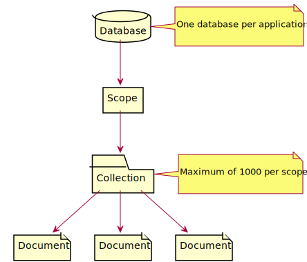
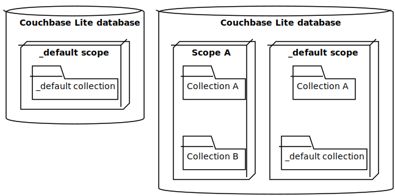

_Working with Couchbase Lite databases_

## Database Concepts

Databases created on Couchbase Lite can share the same hierarchical structure as Couchbase Server or Capella databases.
This makes it easier to sync data between mobile applications and applications built using Couchbase Server or Capella.

<figure markdown id='figure-1'>
  { loading=lazy }
  <figcaption>Figure 1. Couchbase Lite Database Hierarchy</figcaption>
</figure>

Although the terminology is different, the structure can be mapped to relational database terms:

**Table 1. Relational Database → Couchbase**

| Relational database | Couchbase  |
|:--------------------|:-----------|
| Database            | Database   |
| Schema              | Scope      |
| Table               | Collection |

This structure gives you plenty of choices when it comes to partitioning your data. The most basic structure is to use
the single default scope with a single default collection; or you could opt for a structure that allows you to split
your collections into logical scopes.

<figure markdown id='figure-2'>
  { loading=lazy }
  <figcaption>Figure 2. Couchbase Lite Examples</figcaption>
</figure>

!!! note "Storing local configuration"

    You may not need to sync all the data related for a particular application. You can set up a scope that syncs data,
    and a second scope that doesn’t.
    
    One reason for doing this is to store local configuration data (such as the preferred screen orientation or keyboard
    layout). Since this information only relates to a particular device, there is no need to sync it:
    
    <!-- can't have no headers in markdown table, so using raw html -->
    <table><tbody>
    <tr>
    <th>local data scope</th>
    <td>Contains information pertaining to the device.</td>
    </tr>
    <tr>
    <th>syncing data scope</th>
    <td>Contains information pertaining to the user, which can be synced back to the cloud for use on the web or another
    device.</td>
    </tr>
    </tbody></table>

## Create or Open Database

You can create a new database and-or open an existing database, using the [`Database`](
/api/couchbase-lite-ee/kotbase/-database/) class. Just pass in a database name and optionally a [`DatabaseConfiguration`
](/api/couchbase-lite-ee/kotbase/-database-configuration/) — see [Example 1](#example-1).

Things to watch for include:

* If the named database does not exist in the specified, or default, location then a new one is created
* The database is created in a default location unless you specify a directory for it — see [`DatabaseConfiguration`](
  /api/couchbase-lite-ee/kotbase/-database-configuration/) and [`DatabaseConfiguration.setDirectory()`](
  /api/couchbase-lite-ee/kotbase/-database-configuration/set-directory.html)

!!! tip

    Best Practice is to always specify the path to the database explicitly.

Typically, the default location is the application sandbox or current working directory.

See also [Finding a Database File](#finding-a-database-file).

!!! example "<span id='example-1'>Example 1. Open or create a database</span>"

    ```kotlin
    val database = Database(
        "my-db",
        DatabaseConfigurationFactory.newConfig(
            "path/to/database"
        )
    )
    ```

!!! tip

    `"path/to/database"` might be a platform-specific location. Use [`expect`/`actual`](
    https://kotlinlang.org/docs/multiplatform-connect-to-apis.html) or dependency injection to provide a
    platform-specific database path.

## Close Database

You are advised to incorporate the closing of all open databases into your application workflow.

Closing a database is simple, just use [`Database.close()`](/api/couchbase-lite-ee/kotbase/-database/close.html) — see
[Example 2](#example-2). This also closes active replications, listeners and-or live queries connected to the database.

!!! note

    Closing a database soon after starting a replication involving it can cause an exception as the asynchronous
    replicator (start) may not yet be connected.

!!! example "<span id='example-2'>Example 2. Close a Database</span>"

    ```kotlin
    database.close()
    ```

## Database Encryption

!!! important "This is an [Enterprise Edition](https://www.couchbase.com/products/editions/mobile/) feature."

Kotbase includes the ability to encrypt Couchbase Lite databases. This allows mobile applications to secure the data at
rest, when it is being stored on the device. The algorithm used to encrypt the database is 256-bit AES.

### Enabling

To enable encryption, use [`DatabaseConfiguration.setEncryptionKey()`](
/api/couchbase-lite-ee/kotbase/set-encryption-key.html) to set the encryption key of your choice. Provide this
encryption key every time the database is opened — see [Example 3](#example-3).

!!! example "<span id='example-3'>Example 3. Configure Database Encryption</span>"

    ```kotlin
    val db = Database(
        "my-db",
        DatabaseConfigurationFactory.newConfig(
            encryptionKey = EncryptionKey("PASSWORD")
        )
    )
    ```

### Persisting

Couchbase Lite does not persist the key. It is the application’s responsibility to manage the key and store it in a
platform specific secure store such as Apple’s [Keychain](
https://developer.apple.com/documentation/security/keychain_services) or Android’s [Keystore](
https://developer.android.com/training/articles/keystore).

### Opening

An encrypted database can only be opened with the same language SDK that was used to encrypt it in the first place. So a
database encrypted with Kotbase on Android (which uses the Couchbase Lite Android SDK) and then exported, is readable
only by Kotbase on Android or the Couchbase Lite Android SDK.

### Changing

To change an existing encryption key, open the database using its existing encryption-key and use
[`Database.changeEncryptionKey()`](/api/couchbase-lite-ee/kotbase/change-encryption-key.html) to set the required new
encryption-key value.

### Removing

To remove encryption, open the database using its existing encryption-key and use [`Database.changeEncryptionKey()`](
/api/couchbase-lite-ee/kotbase/change-encryption-key.html) with a null value as the encryption key.

## Finding a Database File

### Android

When the application is running on the Android emulator, you can locate the application’s data folder and access the
database file by using the `adb` CLI tools. For example, to list the different databases on the emulator, you can run
the following commands.

!!! example "<span id='example-4'>Example 4. List files</span>"

    ```bash
    $ adb shell
    $ su
    $ cd /data/data/{APPLICATION_ID}/files
    $ ls
    ```

The `adb pull` command can be used to pull a specific database to your host machine.

!!! example "<span id='example-5'>Example 5. Pull using adb command</span>"

    ```bash
    $ adb root
    $ adb pull /data/data/{APPLICATION_ID}/files/{DATABASE_NAME}.cblite2 .
    ```

### iOS

When the application is running on the iOS simulator, you can locate the application’s sandbox directory using the
[OpenSim](https://github.com/luosheng/OpenSim) utility.

## Database Maintenance

From time to time it may be necessary to perform certain maintenance activities on your database, for example to compact the database file, removing unused documents and blobs no longer referenced by any documents.

Couchbase Lite’s API provides the [`Database.performMaintenance()`](
/api/couchbase-lite-ee/kotbase/-database/perform-maintenance.html) method. The available maintenance operations,
including compact are as shown in the enum [`MaintenanceType`](/api/couchbase-lite-ee/kotbase/-maintenance-type/) to
accomplish this.

This is a resource intensive operation and is not performed automatically. It should be run on-demand using the API. If in doubt, consult Couchbase support.

## Command Line Tool

`cblite` is a command-line tool for inspecting and querying Couchbase Lite databases.

You can download and build it from the couchbaselabs [GitHub repository](
https://github.com/couchbaselabs/couchbase-mobile-tools/blob/master/README.cblite.md).

## Troubleshooting

You should use console logs as your first source of diagnostic information. If the information in the default logging
level is insufficient you can focus it on database errors and generate more verbose messages — see [Example
6](#example-6).

For more on using Couchbase logs — see [Using Logs](using-logs.md).

!!! example "<span id='example-6'>Example 6. Increase Level of Database Log Messages</span>"

    ```kotlin
    Database.log.console.domains = setOf(LogDomain.DATABASE) 
    ```
