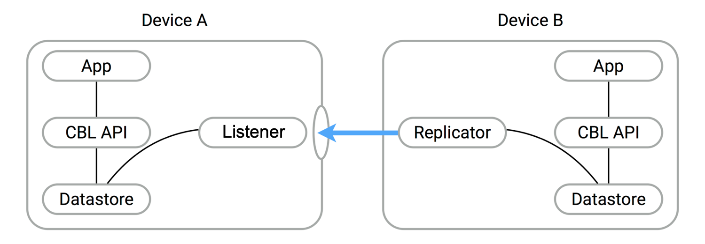

_Couchbase Lite’s Peer-to-Peer Synchronization enables edge devices to synchronize securely without consuming
centralized cloud-server resources_

## Introduction

!!! important "This is an [Enterprise Edition](https://www.couchbase.com/products/editions/mobile/) feature."

Couchbase Lite’s Peer-to-Peer synchronization solution offers secure storage and bidirectional data synchronization
between edge devices without needing a centralized cloud-based control point.

Couchbase Lite’s Peer-to-Peer data synchronization provides:

* Instant WebSocket-based listener for use in Peer-to-Peer applications communicating over IP-based networks
* Simple application development, enabling sync with a short amount of code
* Optimized network bandwidth usage and reduced data transfer costs with Delta Sync support
* Securely sync data with built-in support for Transport Layer Security (TLS) encryption and authentication support
* Document management. Reducing conflicts in concurrent writes with built-in conflict management support
* Built-in network resiliency

## Overview

Peer-to-Peer synchronization requires one Peer to act as the Listener to the other Peer’s replicator.

{ loading=lazy }

Peer-to-Peer synchronization requires one Peer to act as the Listener to the other Peer’s replicator. Therefore, to use
Peer-to-Peer synchronization in your application, you must configure one Peer to act as a Listener using the Couchbase
Listener API, the most important of which include [`URLEndpointListener`](
/api/couchbase-lite-ee/kotbase/-u-r-l-endpoint-listener/) and [`URLEndpointListenerConfiguration`](
/api/couchbase-lite-ee/kotbase/-u-r-l-endpoint-listener-configuration/).

!!! example "Example 1. Simple workflow"

    1. Configure the listener (_passive peer_, or _server_)
    2. Initialize the listener, which listens for incoming WebSocket connections (on a user-defined, or auto-selected,
       port)
    3. Configure a replicator (_active peer_, or _client_)
    4. Use some form of discovery phase, perhaps with a zero-config protocol such as [Network Service Discovery for
       Android](https://developer.android.com/training/connect-devices-wirelessly/nsd) or [Bonjour for iOS](
       https://developer.apple.com/bonjour/), or use known URL endpoints, to identify a listener
    5. Point the replicator at the listener
    6. Initialize the replicator
    7. Replicator and listener engage in the configured security protocol exchanges to confirm connection
    8. If connection is confirmed then replication will commence, synchronizing the two data stores

Here you can see configuration involves a [Passive Peer](passive-peer.md) and an [Active Peer](active-peer.md) and a
user-friendly listener configuration in [Basic Setup](#basic-setup).

You can also learn how to implement Peer-to-Peer synchronization by referring to our tutorial — see [Getting Started
with Peer-to-Peer Synchronization](
https://docs.couchbase.com/tutorials/cbl-p2p-sync-websockets/swift/cbl-p2p-sync-websockets.html).

## Features

Couchbase Lite’s Peer-to-Peer synchronization solution provides support for cross-platform synchronization, for example,
between Android and iOS devices.

Each listener instance serves a single Couchbase Lite database, enabling synchronization for documents within specified
collections of that database.

Having a Listener on a database still allows you to open replications to the other clients. For example, a Listener can
actively begin replicating to other Listeners while listening for connections. These replications can be for the same or
a different database.

The Listener will automatically select a port to use or a user-specified port. It will also listen on all available
networks, unless you specify a specific network.

### Security

Couchbase Lite’s Peer-to-Peer synchronization supports encryption and authentication over TLS with multiple modes,
including:

* No encryption, for example, clear text.
* CA cert
* Self-signed cert
* Anonymous self-signed — an auto-generated anonymous TLS identity is generated if no identity is specified. This TLS
  identity provides encryption but **not** authentication.  
  Any self-signed certificates generated by the convenience API are stored in secure storage.

The replicator (client) can handle certificates pinned by the listener for authentication purposes.

Support is also provided for basic authentication using username and password credentials. Whilst this can be used in
clear text mode, developers are strongly advised to use TLS encryption.

For testing and development purposes, support is provided for the client (active, replicator) to skip verification of
self-signed certificates; this mode should not be used in production.

### Error Handling

When a listener is stopped, then all connected replicators are notified by a WebSocket error. Your application should
distinguish between transient and permanent connectivity errors.

#### Passive peers

A Passive Peer losing connectivity with an Active Peer will clean up any associated endpoint connections to that peer.
The Active Peer may attempt to reconnect to the Passive Peer.

#### Active peers

An Active Peer permanently losing connectivity with a Passive Peer will cease replicating.

An Active Peer temporarily losing connectivity with a passive Peer will use exponential backoff functionality to attempt
reconnection.

### Delta Sync

Optional delta-sync support is provided but is inactive by default.

Delta-sync can be enabled on a per-replication basis provided that the databases involved are also configured to permit
it.

### Conflict Resolution

Conflict resolution for Peer-to-Peer synchronization works in the same way as it does for Sync Gateway replication, with
both custom and automatic resolution available.

## Basic Setup

You can configure a Peer-to-Peer synchronization with just a short amount of code as shown here in [Example 2
](#example-2) and [Example 3](#example-3).

!!! example "<span id='example-2'>Example 2. Simple Listener</span>"

    This simple listener configuration will give you a listener ready to participate in an encrypted synchronization
    with a replicator providing a valid username and password.

    ```kotlin
    val listener = URLEndpointListener(
        URLEndpointListenerConfiguration(
            collections = db.collections,
            authenticator = ListenerPasswordAuthenticator { user, pwd ->
                (user == "daniel") && (pwd.concatToString() == "123")
            }
        )
    )
    listener.start()
    this.listener = listener
    ```

1. Initialize the listener configuration
2. Configure the client authenticator to require basic authentication
3. Initialize the listener
4. Start the listener

!!! example "<span id='example-3'>Example 3. Simple Replicator</span>"

    This simple replicator configuration will give you an encrypted, bi-directional Peer-to-Peer synchronization with
    automatic conflict resolution.

    ```kotlin
    val listenerEndpoint = URLEndpoint("wss://10.0.2.2:4984/db") 
    val repl = Replicator(
        ReplicatorConfiguration(listenerEndpoint)
            .addCollections(collections)
            .apply {
                authenticator = BasicAuthenticator("valid.user", "valid.password.string".toCharArray())
                isAcceptOnlySelfSignedServerCertificate = true
            }
    )
    repl.start() 
    this.replicator = repl
    ```

1. Get the listener’s endpoint. Here we use a known URL, but it could be a URL established dynamically in a discovery
   phase.
2. Initialize the replicator configuration with the collections of the database to be synchronized and the listener it
   is to synchronize with.
3. Configure the replicator to expect a self-signed certificate from the listener.
4. Configure the replicator to present basic authentication credentials if the listener prompts for them (client
   authentication is optional).
5. Initialize the replicator.
6. Start the replicator.

## API Highlights

### URLEndpointListener

The [`URLEndpointListener`](/api/couchbase-lite-ee/kotbase/-u-r-l-endpoint-listener/) is the listener for peer-to-peer
synchronization. It acts like a passive replicator, in the same way that Sync Gateway does in a 'standard' replication.
On the client side, the listener’s endpoint is used to point the replicator to the listener.

Core functionalities of the listener are:

* Users can initialize the class using a `URLEndpointListenerConfiguration` object.
* The listener can be started, or can be stopped.
* Once the listener is started, a total number of connections or active connections can be checked.

### URLEndpointListenerConfiguration

Use [`URLEndpointListenerConfiguration`](/api/couchbase-lite-ee/kotbase/-u-r-l-endpoint-listener-configuration/) to
create a configuration object you can then use to initialize the listener.

[`port`](/api/couchbase-lite-ee/kotbase/-u-r-l-endpoint-listener-configuration/port.html)

This is the port that the listener will listen to.

If the port is zero, the listener will auto-assign an available port to listen on.

Default value is zero. When the listener is not started, the port zero.

[`networkInterface`](/api/couchbase-lite-ee/kotbase/-u-r-l-endpoint-listener-configuration/network-interface.html)

Use this to select a specific Network Interface to use, in the form of the IP Address or network interface name.

If the network interface is specified, only that interface wil be used.

If the network interface is not specified, all available network interfaces will be used.

The value is null if the listener is not started.

[`isTlsDisabled`](/api/couchbase-lite-ee/kotbase/-u-r-l-endpoint-listener-configuration/is-tls-disabled.html)

You can use `URLEndpointListenerConfiguration`'s `isTlsDisabled` property to disable TLS communication if necessary.

The `isTlsDisabled` setting must be `false` when _Client Cert Authentication_ is required.

_Basic Authentication_ can be used with, or without, TLS.

`isTlsDisabled` works in conjunction with [`TLSIdentity`](/api/couchbase-lite-ee/kotbase/-t-l-s-identity/), to enable
developers to define the key and certificate to be used.

* If `isTlsDisabled` is `true` — TLS communication is disabled and `tlsIdentity` is ignored.  
  Active peers will use the `ws://` URL scheme used to connect to the listener.
* If `isTlsDisabled` is `false` or not specified — TLS communication is enabled.  
  Active peers will use the `wss://` URL scheme to connect to the listener.

[`tlsIdentity`](/api/couchbase-lite-ee/kotbase/-u-r-l-endpoint-listener-configuration/tls-identity.html)

Use `URLEndpointListenerConfiguration`'s `tlsIdentity` property to configure the TLS Identity used in TLS communication.

If [`TLSIdentity`](/api/couchbase-lite-ee/kotbase/-t-l-s-identity/) is not set, then the listener uses an auto-generated
anonymous self-signed identity (unless `isTlsDisabled = true`). Whilst the client cannot use this to authenticate the
server, it will use it to encrypt communication, giving a more secure option than non-TLS communication.

The auto-generated anonymous self-signed identity is saved in secure storage for future use to obviate the need to
re-generate it.

When the listener is not started, the identity is null. When TLS is disabled, the identity is always null.

[`authenticator`](/api/couchbase-lite-ee/kotbase/-u-r-l-endpoint-listener-configuration/authenticator.html)

Use this to specify the authenticator the listener uses to authenticate the client’s connection request. This should be
set to one of the following:

* [`ListenerPasswordAuthenticator`](/api/couchbase-lite-ee/kotbase/-listener-password-authenticator/)
* [`ListenerCertificateAuthenticator`](/api/couchbase-lite-ee/kotbase/-listener-certificate-authenticator/)
* `null` — there is no authentication

[`isReadOnly`](/api/couchbase-lite-ee/kotbase/-u-r-l-endpoint-listener-configuration/is-read-only.html)

Use this to allow only pull replication. The default value is `false`.

[`isDeltaSyncEnabled`](/api/couchbase-lite-ee/kotbase/-u-r-l-endpoint-listener-configuration/is-delta-sync-enabled.html)

The option to enable Delta Sync and replicate only changed data also depends on the delta sync settings at database
level. The default value is `false`.

## Security

Couchbase Lite’s Peer-to-Peer synchronization ensures secure communication through TLS and supports multiple
authentication mechanisms.

### TLS Identity

The URLEndpointListener uses a TLS identity to establish secure connections. (A TLS identity is an RSA public/private
key pair and certificate.) The identity can include either a certificate signed by a trusted Certificate Authority (CA),
or a self-signed certificate. If no identity is specified, the listener automatically generates an anonymous,
self-signed certificate, which is primarily used for encryption, but not for authentication.

When replicating with a listener that uses a self-signed certificate, the replicator (client) can be configured to skip
certificate validation. This option is useful for development or testing, but not recommended for production.

!!! note

    The minimum supported version of TLS is TLS 1.2.

### Authentication Mechanisms

The URLEndpointListener supports two authentication mechanisms:

* Basic Authentication, using a username and password.
* Certificate Authentication, which authenticates clients using client certificates, and is only available when TLS is
  enabled.

### Using Secure Storage

TLS and its associated keys and certificates might require using secure storage to minimize the chances of a security
breach. The implementation of this storage differs from platform to platform. This table summarizes the secure storage
used to store keys and certificates.

=== "Android"

    **Secure storage details**

    <!-- can't have no headers in markdown table, so using raw html -->
    <table><tbody>
    <tr>
    <th>Platform</th>
    <td>Android</td>
    </tr>
    <tr>
    <th>Key Storage</th>
    <td>Android System KeyStore</td>
    </tr>
    <tr>
    <th>Certificate Storage</th>
    <td>Android System KeyStore</td>
    </tr>
    <tr>
    <th>Notes</th>
    <td><ul>
    <li>Android KeyStore was introduced from Android API 18.</li>
    <li>Android KeyStore security has evolved over time to provide more secure support. Please check this document for
    more info: [Hardware-backed Keystore](https://source.android.com/security/keystore).</li>
    </ul></td>
    </tr>
    <tr>
    <th>Reference</th>
    <td>[Android Keystore system](https://developer.android.com/training/articles/keystore)</td>
    </tr>
    </tbody></table>

=== "macOS/iOS"

    **Secure storage details**

    <!-- can't have no headers in markdown table, so using raw html -->
    <table><tbody>
    <tr>
    <th>Platform</th>
    <td>macOS/iOS</td>
    </tr>
    <tr>
    <th>Key Storage</th>
    <td>KeyChain</td>
    </tr>
    <tr>
    <th>Certificate Storage</th>
    <td>KeyChain</td>
    </tr>
    <tr>
    <th>Notes</th>
    <td>Use kSecAttrLabel of the SecCertificate to store the TLSIdentity’s label</td>
    </tr>
    <tr>
    <th>Reference</th>
    <td>[Keychain services](https://developer.apple.com/documentation/security/keychain_services)</td>
    </tr>
    </tbody></table>

=== "Java"

    **Secure storage details**

    <!-- can't have no headers in markdown table, so using raw html -->
    <table><tbody>
    <tr>
    <th>Platform</th>
    <td>Java</td>
    </tr>
    <tr>
    <th>Key Storage</th>
    <td>User Specified KeyStore</td>
    </tr>
    <tr>
    <th>Certificate Storage</th>
    <td>User Specified KeyStore</td>
    </tr>
    <tr>
    <th>Notes</th>
    <td><ul>
    <li>The KeyStore represents a storage facility for cryptographic keys and certificates. It’s users' choice to decide
    whether to persist the KeyStore or not.</li>
    <li>The supported KeyStore types are PKCS12 (Default from Java 9) and JKS (Default on Java 8 and below).</li>
    </ul></td>
    </tr>
    <tr>
    <th>Reference</th>
    <td>[Class KeyStore](https://docs.oracle.com/javase/7/docs/api/java/security/KeyStore.html)</td>
    </tr>
    </tbody></table>

=== "Windows"

    **Secure storage details**

    <!-- can't have no headers in markdown table, so using raw html -->
    <table><tbody>
    <tr>
    <th>Platform</th>
    <td>Windows</td>
    </tr>
    <tr>
    <th>Key Storage</th>
    <td>CNG Key Storage Provider</td>
    </tr>
    <tr>
    <th>Certificate Storage</th>
    <td>CNG Key Storage Provider</td>
    </tr>
    <th>Reference</th>
    <td>[Key Storage and Retrieval](https://learn.microsoft.com/en-us/windows/win32/seccng/key-storage-and-retrieval)
    </td>
    </tr>
    </tbody></table>

=== "Linux"

    As Linux-based operating systems do not have a standard or common secure key storage, Couchbase Lite C does not
    support persisting generated identities with the specified label on this platform.
    
    As an alternative, Couchbase Lite C enables developers to implement their own cryptographic operations through a set
    of callbacks, enabling certificate signing and other cryptographic tasks during the TLS handshake using a private
    key stored in their preferred secure key storage. These callbacks allow operations like signing data, with the
    private key remaining securely stored and never exposed. The key idea is that all cryptographic operations are
    performed within secure key storage, ensuring that the private key is protected throughout the TLS handshake
    process.
