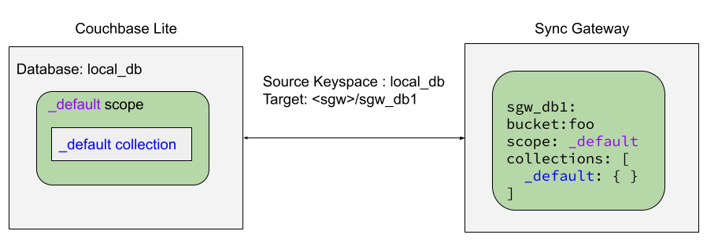
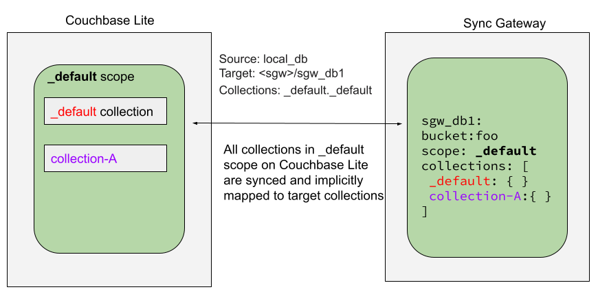
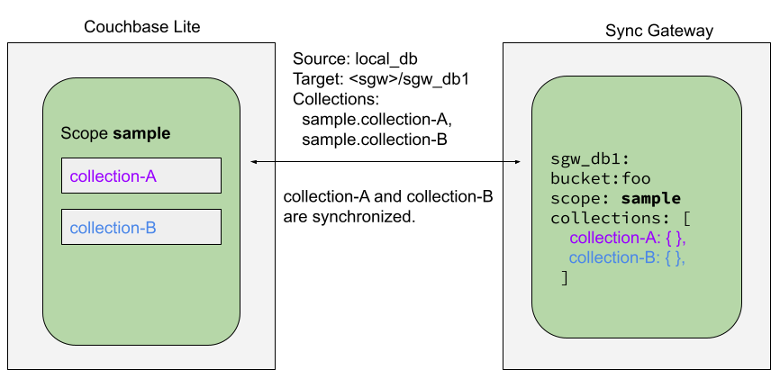
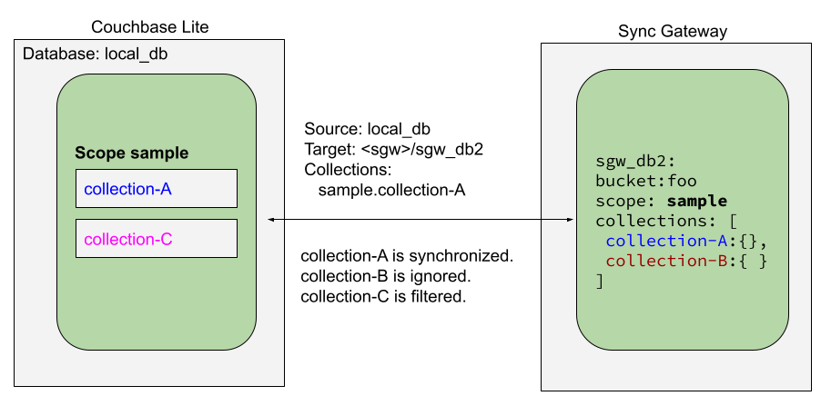

_Couchbase Lite — Synchronizing data changes between local and remote databases using Sync Gateway_

!!! warning "Android enablers"

    **Allow Unencrypted Network Traffic**

    To use cleartext, un-encrypted, network traffic (`http://` and-or `ws://`), include
    `android:usesCleartextTraffic="true"` in the `application` element of the manifest as shown on
    [developer.android.com](https://developer.android.com/training/articles/security-config#CleartextTrafficPermitted).  
    **This is not recommended in production.**

!!! warning "Use Background Threads"

    As with any network or file I/O activity, Couchbase Lite activities should not be performed on the UI thread.
    **Always** use a **background** thread.

!!! note "Code Snippets"

    All code examples are indicative only. They demonstrate the basic concepts and approaches to using a feature. Use
    them as inspiration and adapt these examples to best practice when developing applications for your platform.

## Introduction

Couchbase Lite provides API support for secure, bi-directional, synchronization of data changes between mobile
applications and a central server database. It does so by using a _replicator_ to interact with Sync Gateway.

The _replicator_ is designed to manage replication of documents and-or document changes between a source and a target
database. For example, between a local Couchbase Lite database and remote Sync Gateway database, which is ultimately
mapped to a bucket in a Couchbase Server instance in the cloud or on a server.

This page shows sample code and configuration examples covering the implementation of a replication using Sync Gateway.

Your application runs a replicator (also referred to here as a client), which will initiate connection with a Sync
Gateway (also referred to here as a server) and participate in the replication of database changes to bring both local
and remote databases into sync.

Subsequent sections provide additional details and examples for the main configuration options.

## Replication Concepts

Couchbase Lite allows for one database for each application running on the mobile device. This database can contain one
or more scopes. Each scope can contain one or more collections.

To learn about Scopes and Collections, see [Databases](databases.md).

You can set up a replication scheme across these data levels:

**Database**  
The `_default` collection is synced.

**Collection**  
A specific collection or a set of collections is synced.

As part of the syncing setup, the Sync Gateway has to map the Couchbase Lite database to the Couchbase Server or Capella
database being synced.

## Replication Protocol

### Scheme

Couchbase Mobile uses a replication protocol based on WebSockets for replication. To use this protocol the replication
URL should specify WebSockets as the URL scheme (see the [Configure Target](#configure-target) section below).

### Ordering

To optimize for speed, the replication protocol doesn’t guarantee that documents will be received in a particular order.
So we don’t recommend to rely on that when using the replication or database change listeners for example.

## Scopes and Collections

Scopes and Collections allow you to organize your documents in Couchbase Lite.

When syncing, you can configure the collections to be synced.

The collections specified in the Couchbase Lite replicator setup must exist (both scope and collection name must be
identical) on the Sync Gateway side, otherwise starting the Couchbase Lite replicator will result in an error.

During replication:

1. If Sync Gateway config (or server) is updated to remove a collection that is being synced, the client replicator will
   be offline and will be stopped after the first retry. An error will be reported.
2. If Sync Gateway config is updated to add a collection to a scope that is being synchronized, the replication will
   ignore the collection. The added collection will not automatically sync until the Couchbase Lite replicator’s
   configuration is updated.

### Default Collection

When upgrading Couchbase Lite to 3.1, the existing documents in the database will be automatically migrated to the
default collection.

For backward compatibility with the code prior to 3.1, when you set up the replicator with the database, the default
collection will be set up to sync with the default collection on Sync Gateway.

**Sync Couchbase Lite database with the default collection on Sync Gateway**
{ loading=lazy }

**Sync Couchbase Lite default collection with default collection on Sync Gateway**
{ loading=lazy }

### User-Defined Collections

The user-defined collections specified in the Couchbase Lite replicator setup must exist (and be identical) on the Sync Gateway side to sync.

**Syncing scope with user-defined collections**
{ loading=lazy }

**Syncing scope with user-defined collections. Couchbase Lite has more collections than the Sync Gateway configuration
(with collection filters)**
{ loading=lazy }

## Configuration Summary

You should configure and initialize a replicator for each Couchbase Lite database instance you want to sync. [Example
1](#example-1) shows the configuration and initialization process.

!!! note

    You need Couchbase Lite 3.1+ and Sync Gateway 3.1+ to use `custom` Scopes and Collections.  
    If you’re using Capella App Services or Sync Gateway releases that are older than version 3.1, you won’t be able to
    access `custom` Scopes and Collections. To use Couchbase Lite 3.1+ with these older versions, you can use the
    `default` Collection as a backup option.

!!! example "<span id='example-1'>Example 1. Replication configuration and initialization</span>"

    ```kotlin
    val repl = Replicator(
        // initialize the replicator configuration
        ReplicatorConfigurationFactory.newConfig(
            target = URLEndpoint("wss://listener.com:8954"),
    
            collections = mapOf(collections to null),
    
            // Set replicator type
            type = ReplicatorType.PUSH_AND_PULL,
    
            // Configure Sync Mode
            continuous = false, // default value
    
            // set auto-purge behavior
            // (here we override default)
            enableAutoPurge = false,
    
            // Configure Server Authentication --
            // only accept self-signed certs
            acceptOnlySelfSignedServerCertificate = true,
    
            // Configure the credentials the
            // client will provide if prompted
            authenticator = BasicAuthenticator("PRIVUSER", "let me in".toCharArray())
        )
    )
    
    // Optionally add a change listener
    val token = repl.addChangeListener { change ->
        val err: CouchbaseLiteException? = change.status.error
        if (err != null) {
            println("Error code ::  ${err.code}\n$err")
        }
    }
    
    // Start replicator
    repl.start(false)
    
    this.replicator = repl
    this.token = token
    ```

**Notes on Example**

1. Get endpoint for target database.
2. Use the [`ReplicatorConfiguration`](/api/couchbase-lite-ee/kotbase/-replicator-configuration/) class’s constructor —
   [`ReplicatorConfiguration(Endpoint)`](
   /api/couchbase-lite-ee/kotbase/-replicator-configuration/-replicator-configuration.html) — to initialize the
   replicator configuration — see also [Configure Target](#configure-target).
3. The default is to auto-purge documents that this user no longer has access to — see [Auto-purge on Channel Access
   Revocation](#auto-purge-on-channel-access-revocation). Here we override this behavior by setting its flag to false.
4. Configure how the client will authenticate the server. Here we say connect only to servers presenting a self-signed
   certificate. By default, clients accept only servers presenting certificates that can be verified using the OS
   bundled Root CA Certificates — see [Server Authentication](#server-authentication).
5. Configure the client-authentication credentials (if required). These are the credential the client will present to
   sync gateway if requested to do so.  
   Here we configure to provide _Basic Authentication_ credentials. Other options are available — see [Client
   Authentication](#client-authentication).
6. Configure how the replication should handle conflict resolution — see [Handling Data Conflicts](
   handling-data-conflicts.md) topic for mor on conflict resolution.
7. Initialize the replicator using your configuration — see [Initialize](#initialize).
8. Optionally, register an observer, which will notify you of changes to the replication status — see [Monitor
   ](#monitor).
9. Start the replicator — see [Start Replicator](#start-replicator).

## Configure

**In this section**  
[Configure Target](#configure-target) | [Sync Mode](#sync-mode) | [Retry Configuration](#retry-configuration) | [User
Authorization](#user-authorization) | [Server Authentication](#server-authentication) | [Client Authentication
](#client-authentication) | [Monitor Document Changes](#monitor-document-changes) | [Custom Headers](#custom-headers) |
[Checkpoint Starts](#checkpoint-starts) | [Replication Filters](#replication-filters) | [Channels](#channels) |
[Auto-purge on Channel Access Revocation](#auto-purge-on-channel-access-revocation) | [Delta Sync](#delta-sync)

### Configure Target

Initialize and define the replication configuration with local and remote database locations using the
[`ReplicatorConfiguration`](/api/couchbase-lite-ee/kotbase/-replicator-configuration/) object.

The constructor provides the server’s URL (including the port number and the name of the remote database to sync with).

It is expected that the app will identify the IP address and URL and append the remote database name to the URL
endpoint, producing for example: `wss://10.0.2.2:4984/travel-sample`.

The URL scheme for web socket URLs uses `ws:` (non-TLS) or `wss:` (SSL/TLS) prefixes.

!!! note

    On the Android platform, to use cleartext, un-encrypted, network traffic (`http://` and-or `ws://`), include
    `android:usesCleartextTraffic="true"` in the `application` element of the manifest as shown on
    [developer.android.com](https://developer.android.com/training/articles/security-config#CleartextTrafficPermitted).  
    **This is not recommended in production.**

Add the database collections to sync along with the [`CollectionConfiguration`](
/api/couchbase-lite-ee/kotbase/-collection-configuration/) for each to the `ReplicatorConfiguration`. Multiple
collections can use the same configuration, or each their own as needed. A null configuration will use the default
configuration values, found in [`Defaults.Replicator`](/api/couchbase-lite-ee/kotbase/-defaults/-replicator/).

!!! example "Example 2. Add Target to Configuration"

    ```kotlin
    // initialize the replicator configuration
    val config = ReplicatorConfiguration(
        URLEndpoint("wss://10.0.2.2:8954/travel-sample")
    ).addCollections(collections, null)
    ```

    Note use of the scheme prefix (`wss://` to ensure TLS encryption — strongly recommended in production — or `ws://`)

### Sync Mode

Here we define the direction and type of replication we want to initiate.

We use [`ReplicatorConfiguration`](/api/couchbase-lite-ee/kotbase/-replicator-configuration/) class’s [`type`](
/api/couchbase-lite-ee/kotbase/-replicator-configuration/type.html) and [`isContinuous`](
/api/couchbase-lite-ee/kotbase/-replicator-configuration/is-continuous.html) parameters, to tell the replicator:

* The type (or direction) of the replication: `PUSH_AND_PULL`; `PULL`; `PUSH`
* The replication mode, that is either of:
    * Continuous — remaining active indefinitely to replicate changed documents (`isContinuous=true`).
    * Ad-hoc — a one-shot replication of changed documents (`isContinuous=false`).

!!! example "Example 3. Configure replicator type and mode"

    ```kotlin
    // Set replicator type
    type = ReplicatorType.PUSH_AND_PULL,
    
    // Configure Sync Mode
    continuous = false, // default value
    ```

!!! tip

    Unless there is a solid use-case not to, always initiate a single `PUSH_AND_PULL` replication rather than identical
    separate `PUSH` and `PULL` replications.

    This prevents the replications generating the same checkpoint `docID` resulting in multiple conflicts.

### Retry Configuration

Couchbase Lite’s replication retry logic assures a resilient connection.

The replicator minimizes the chance and impact of dropped connections by maintaining a heartbeat; essentially pinging
the Sync Gateway at a configurable interval to ensure the connection remains alive.

In the event it detects a transient error, the replicator will attempt to reconnect, stopping only when the connection
is re-established, or the number of retries exceeds the retry limit (9 times for a single-shot replication and unlimited
for a continuous replication).

On each retry the interval between attempts is increased exponentially (exponential backoff) up to the maximum wait time
limit (5 minutes).

The REST API provides configurable control over this replication retry logic using a set of configurable properties —
see [Table 1](#table-1).

**Table 1. Replication Retry Configuration Properties**

| <div style="min-width:173px">Property</div>                                                                          | Use cases                                                                                                                                                                                                                                                                  | Description                                                                                                                                                                                                                                                                                                                                                                                                                                                                                                                                         |
|:---------------------------------------------------------------------------------------------------------------------|:---------------------------------------------------------------------------------------------------------------------------------------------------------------------------------------------------------------------------------------------------------------------------|:----------------------------------------------------------------------------------------------------------------------------------------------------------------------------------------------------------------------------------------------------------------------------------------------------------------------------------------------------------------------------------------------------------------------------------------------------------------------------------------------------------------------------------------------------|
| [`setHeartbeat()`](/api/couchbase-lite-ee/kotbase/-replicator-configuration/set-heartbeat.html)                      | <ul><li>Reduce to detect connection errors sooner</li><li>Align to load-balancer or proxy `keep-alive` interval — see Sync Gateway’s topic [Load Balancer - Keep Alive](https://docs.couchbase.com/sync-gateway/current/load-balancer.html#websocket-connection)</li></ul> | The interval (in seconds) between the heartbeat pulses.<br><br>Default: The replicator pings the Sync Gateway every 300 seconds.                                                                                                                                                                                                                                                                                                                                                                                                                    |
| [`setMaxAttempts()`](/api/couchbase-lite-ee/kotbase/-replicator-configuration/set-max-attempts.html)                 | Change this to limit or extend the number of retry attempts.                                                                                                                                                                                                               | The maximum number of retry attempts<ul><li>Set to zero (0) to use default values</li><li>Set to one (1) to prevent any retry attempt</li><li>The retry attempt count is reset when the replicator is able to connect and replicate</li><li>Default values are:<ul><li>Single-shot replication = 9;</li><li>Continuous replication = maximum integer value</li></ul></li><li>Negative values generate a Couchbase exception `InvalidArgumentException`</li></ul>                                                                                    |
| [`setMaxAttemptWaitTime()`](/api/couchbase-lite-ee/kotbase/-replicator-configuration/set-max-attempt-wait-time.html) | Change this to adjust the interval between retries.                                                                                                                                                                                                                        | The maximum interval between retry attempts<br><br>While you can configure the **maximum permitted** wait time, the replicator’s exponential backoff algorithm calculates each individual interval which is not configurable.<ul><li>Default value: 300 seconds (5 minutes)</li><li>Zero sets the maximum interval between retries to the default of 300 seconds</li><li>300 sets the maximum interval between retries to the default of 300 seconds</li><li>A negative value generates a Couchbase exception, `InvalidArgumentException`</li></ul> |

When necessary you can adjust any or all of those configurable values — see [Example 4](#example-4) for how to do this.

!!! example "<span id='example-4'>Example 4. Configuring Replication Retries</span>"

    ```kotlin
    val repl = Replicator(
        ReplicatorConfigurationFactory.newConfig(
            target = URLEndpoint("ws://localhost:4984/mydatabase"),
            collections = mapOf(collections to null),
            //  other config params as required . .
            heartbeat = 150, 
            maxAttempts = 20,
            maxAttemptWaitTime = 600
        )
    )
    repl.start()
    this.replicator = repl
    ```

### User Authorization

By default, Sync Gateway does not enable user authorization. This makes it easier to get up and running with
synchronization.

You can enable authorization in the sync gateway configuration file, as shown in [Example 5](#example-5).

!!! example "<span id='example-5'>Example 5. Enable Authorization</span>"

    ```json
    {
      "databases": {
        "mydatabase": {
          "users": {
            "GUEST": { "disabled": true }
          }
        }
      }
    }
    ```

To authorize with Sync Gateway, an associated user must first be created. Sync Gateway users can be created through the
[`POST /{db}/_user`](
https://docs.couchbase.com/sync-gateway/current/rest-api-admin.html#/Database_Security/post_db__user_) endpoint on the
Admin REST API.

### Server Authentication

Define the credentials your app (the client) is expecting to receive from the Sync Gateway (the server) in order to
ensure it is prepared to continue with the sync.

Note that the client cannot authenticate the server if TLS is turned off. When TLS is enabled (Sync Gateway’s default)
the client must authenticate the server. If the server cannot provide acceptable credentials then the connection will
fail.

Use [`ReplicatorConfiguration`](/api/couchbase-lite-ee/kotbase/-replicator-configuration/) properties
[`setAcceptOnlySelfSignedServerCertificate`](
/api/couchbase-lite-ee/kotbase/set-accept-only-self-signed-server-certificate.html) and [`setPinnedServerCertificate`](
/api/couchbase-lite-ee/kotbase/-replicator-configuration/set-pinned-server-certificate.html), to tell the replicator how
to verify server-supplied TLS server certificates.

* If there is a pinned certificate, nothing else matters, the server cert must **exactly** match the pinned certificate.
* If there are no pinned certs and [`setAcceptOnlySelfSignedServerCertificate`](
  /api/couchbase-lite-ee/kotbase/set-accept-only-self-signed-server-certificate.html) is `true` then any self-signed
  certificate is accepted. Certificates that are not self-signed are rejected, no matter who signed them.
* If there are no pinned certificates and [`setAcceptOnlySelfSignedServerCertificate`](
  /api/couchbase-lite-ee/kotbase/set-accept-only-self-signed-server-certificate.html) is `false` (default), the client
  validates the server’s certificates against the system CA certificates. The server must supply a chain of certificates
  whose root is signed by one of the certificates in the system CA bundle.

!!! example "Example 6. Set Server TLS security"

    === "CA Cert"

        Set the client to expect and accept only CA attested certificates.

        ```kotlin
        // Configure Server Security
        // -- only accept CA attested certs
        acceptOnlySelfSignedServerCertificate = false,
        ```

        This is the default. Only certificate chains with roots signed by a trusted CA are allowed. Self-signed
        certificates are not allowed.
    
    === "Self-Signed Cert"

        Set the client to expect and accept only self-signed certificates.

        ```kotlin
        // Configure Server Authentication --
        // only accept self-signed certs
        acceptOnlySelfSignedServerCertificate = true,
        ```

        Set this to `true` to accept any self-signed cert. Any certificates that are not self-signed are rejected.
    
    === "Pinned Certificate"

        Set the client to expect and accept only a pinned certificate.

        ```kotlin
        // Use the pinned certificate from the byte array (cert)
        pinnedServerCertificate = TLSIdentity.getIdentity("Our Corporate Id")
            ?.certs?.firstOrNull()
            ?: throw IllegalStateException("Cannot find corporate id"),
        ```

        Configure the pinned certificate using data from the byte array `cert`

This all assumes that you have configured the Sync Gateway to provide the appropriate SSL certificates, and have
included the appropriate certificate in your app bundle — for more on this see [Certificate Pinning
](#certificate-pinning).

### Client Authentication

There are two ways to authenticate from a Couchbase Lite client: [Basic Authentication](#basic-authentication) or
[Session Authentication](#session-authentication).

#### Basic Authentication

You can provide a username and password to the basic authenticator class method. Under the hood, the replicator will
send the credentials in the first request to retrieve a `SyncGatewaySession` cookie and use it for all subsequent
requests during the replication. This is the recommended way of using basic authentication. [Example 7](#example-7)
shows how to initiate a one-shot replication as the user **username** with the password **password**.

!!! example "<span id='example-7'>Example 7. Basic Authentication</span>"

    ```kotlin
    // Create replicator (be sure to hold a reference somewhere that will prevent the Replicator from being GCed)
    val repl = Replicator(
        ReplicatorConfigurationFactory.newConfig(
            target = URLEndpoint("ws://localhost:4984/mydatabase"),
            collections = mapOf(collections to null),
            authenticator = BasicAuthenticator("username", "password".toCharArray())
        )
    )
    repl.start()
    this.replicator = repl
    ```

#### Session Authentication

Session authentication is another way to authenticate with Sync Gateway.

A user session must first be created through the [`POST /{db}/_session`](
https://docs.couchbase.com/sync-gateway/current/rest-api.html#/Session/post_db__session) endpoint on the Public REST
API.

The HTTP response contains a session ID which can then be used to authenticate as the user it was created for.

See [Example 8](#example-8), which shows how to initiate a one-shot replication with the session ID returned from the
[`POST /{db}/_session`](https://docs.couchbase.com/sync-gateway/current/rest-api.html#/Session/post_db__session)
endpoint.

!!! example "<span id='example-8'>Example 8. Session Authentication</span>"

    ```kotlin
    // Create replicator (be sure to hold a reference somewhere that will prevent the Replicator from being GCed)
    val repl = Replicator(
        ReplicatorConfigurationFactory.newConfig(
            target = URLEndpoint("ws://localhost:4984/mydatabase"),
            collections = mapOf(collections to null),
            authenticator = SessionAuthenticator("904ac010862f37c8dd99015a33ab5a3565fd8447")
        )
    )
    repl.start()
    this.replicator = repl
    ```

### Custom Headers

Custom headers can be set on the configuration object. The replicator will then include those headers in every request.

This feature is useful in passing additional credentials, perhaps when an authentication or authorization step is being
done by a proxy server (between Couchbase Lite and Sync Gateway) — see [Example 9](#example-9).

!!! example "<span id='example-9'>Example 9. Setting custom headers</span>"

    ```kotlin
    // Create replicator (be sure to hold a reference somewhere that will prevent the Replicator from being GCed)
    val repl = Replicator(
        ReplicatorConfigurationFactory.newConfig(
            target = URLEndpoint("ws://localhost:4984/mydatabase"),
            collections = mapOf(collections to null),
            headers = mapOf("CustomHeaderName" to "Value")
        )
    )
    repl.start()
    this.replicator = repl
    ```

### Replication Filters

Replication Filters allow you to have quick control over the documents stored as the result of a push and/or pull
replication.

#### Push Filter

The push filter allows an app to push a subset of a database to the server. This can be very useful. For instance,
high-priority documents could be pushed first, or documents in a "draft" state could be skipped.

```kotlin
val collectionConfig = CollectionConfigurationFactory.newConfig(
    pushFilter = { _, flags -> flags.contains(DocumentFlag.DELETED) }
)

// Create replicator (be sure to hold a reference somewhere that will prevent the Replicator from being GCed)
val repl = Replicator(
    ReplicatorConfigurationFactory.newConfig(
        target = URLEndpoint("ws://localhost:4984/mydatabase"),
        collections = mapOf(collections to collectionConfig)
    )
)
repl.start()
this.replicator = repl
```

The callback should follow the semantics of a [pure function](https://en.wikipedia.org/wiki/Pure_function). Otherwise,
long-running functions would slow down the replicator considerably. Furthermore, your callback should not make
assumptions about what thread it is being called on.

#### Pull Filter

The pull filter gives an app the ability to validate documents being pulled, and skip ones that fail. This is an
important security mechanism in a peer-to-peer topology with peers that are not fully trusted.

!!! note

    Pull replication filters are not a substitute for channels. Sync Gateway [channels](
    https://docs.couchbase.com/sync-gateway/current/channels.html) are designed to be scalable (documents are filtered
    on the server) whereas a pull replication filter is applied to a document once it has been downloaded.

```kotlin
val collectionConfig = CollectionConfigurationFactory.newConfig(
    pullFilter = { document, _ -> "draft" == document.getString("type") }
)

// Create replicator (be sure to hold a reference somewhere that will prevent the Replicator from being GCed)
val repl = Replicator(
    ReplicatorConfigurationFactory.newConfig(
        target = URLEndpoint("ws://localhost:4984/mydatabase"),
        collections = mapOf(collections to collectionConfig)
    )
)
repl.start()
this.replicator = repl
```

The callback should follow the semantics of a [pure function](https://en.wikipedia.org/wiki/Pure_function). Otherwise,
long-running functions would slow down the replicator considerably. Furthermore, your callback should not make
assumptions about what thread it is being called on.

!!! warning "Losing access to a document via the Sync Function."

    Losing access to a document (via the Sync Function) also triggers the pull replication filter.
    
    Filtering out such an event would retain the document locally.
    
    As a result, there would be a local copy of the document disjointed from the one that resides on Couchbase Server.
    
    Further updates to the document stored on Couchbase Server would not be received in pull replications and further local edits could be pushed but the updated versions will not be visible.
    
    For more information, see [Auto-purge on Channel Access Revocation](#auto-purge-on-channel-access-revocation).

### Channels

By default, Couchbase Lite gets all the channels to which the configured user account has access.

This behavior is suitable for most apps that rely on [user authentication](
https://docs.couchbase.com/sync-gateway/current/authentication-users.html) and the [sync function](
https://docs.couchbase.com/sync-gateway/current/sync-function-api.html) to specify which data to pull for each user.

Optionally, it’s also possible to specify a string array of channel names on Couchbase Lite’s replicator configuration
object. In this case, the replication from Sync Gateway will only pull documents tagged with those channels.

### Auto-purge on Channel Access Revocation

!!! warning "This is a Breaking Change at 3.0"

#### New outcome

By default, when a user loses access to a channel all documents in the channel (that do not also belong to any of the
user’s other channels) are auto-purged from the local database (in devices belonging to the user).

#### Prior outcome

_Previously these documents remained in the local database_

Prior to CBL 3.0, CBL auto-purged only in the case when the user loses access to a document by removing the doc from all
of the channels belonging to the user. Now, in addition to 2.x auto purge, Couchbase Lite also auto-purges the docs when
the user loses access to the doc via channel access revocation. This feature is enabled by default, but an opt-out is
available.

#### Behavior

Users may lose access to channels in a number of ways:

* User loses direct access to channel
* User is removed from a role
* A channel is removed from a role the user is assigned to

By default, when a user loses access to a channel, the next Couchbase Lite pull replication auto-purges all documents in
the channel from local Couchbase Lite databases (on devices belonging to the user) **unless** they belong to any of the
user’s other channels — see [Table 2](#table-2).

Documents that exist in multiple channels belonging to the user (even if they are not actively replicating that channel)
are not auto-purged unless the user loses access to all channels.

Users will receive an `ACCESS_REMOVED` notification from the `DocumentReplicationListener` if they lose document access
due to channel access revocation; this is sent regardless of the current auto-purge setting.

<span id='table-2'>**Table 2. Behavior following access revocation**</span>

<!-- can't have headers span multiple columns in markdown table, so using raw html -->
<table>
<thead>
<tr>
<th style="text-align: center;" colspan="2">System State</th>
<th style="text-align: center;">Impact on Sync</th>
</tr>
</thead>
<tbody>
<tr>
<th style="text-align: center;">Replication Type</th>
<th style="text-align: center;">Access Control on Sync Gateway</th>
<th style="text-align: center;">Expected behavior when <em><code>isAutoPurgeEnabled=true</code></em></th>
</tr>
<tr>
<th style="text-align: center;">Pull only</th>
<td><p>User REVOKED access to channel.</p>
<p>Sync Function includes <code>requireAccess(revokedChannel)</code></p></td>
<td><p>Previously synced documents are auto purged on local</p></td>
</tr>
<tr>
<th style="text-align: center;">Push only</th>
<td><p>User REVOKED access to channel.</p>
<p>Sync Function includes <code>requireAccess(revokedChannel)</code></p></td>
<td><p>No impact of auto-purge</p>
<p>Documents get pushed but are rejected by Sync Gateway</p></td>
</tr>
<tr>
<th style="text-align: center;">Push-pull</th>
<td><p>User REVOKED access to channel.</p>
<p>Sync Function includes <code>requireAccess(revokedChannel)</code></p></td>
<td><p>Previously synced documents are auto purged on Couchbase Lite.</p>
<p>Local changes continue to be  pushed to remote but are rejected by Sync Gateway</p></td>
</tr>
</tbody>
</table>

If a user subsequently regains access to a lost channel, then any previously auto-purged documents still assigned to any
of their channels are automatically pulled down by the active Sync Gateway when they are next updated — see behavior
summary in [Table 3](#table-3).

<span id='table-3'>**Table 3. Behavior if access is regained**</span>

<!-- can't have headers span multiple columns in markdown table, so using raw html -->
<table>
<thead>
<tr>
<th style="text-align: center;" colspan="2">System State</th>
<th style="text-align: center;">Impact on Sync</th>
</tr>
</thead>
<tbody>
<tr>
<th style="text-align: center;">Replication Type</th>
<th style="text-align: center; min-width:234px">Access Control on Sync Gateway</th>
<th style="text-align: center;">Expected behavior when <em><code>isAutoPurgeEnabled=true</code></em></th>
</tr>
<tr>
<th style="text-align: center;">Pull only</th>
<td>User REASSIGNED access to channel</td>
<td><p>Previously purged documents that are still in the channel are automatically pulled by Couchbase Lite when they are next updated</p></td>
</tr>
<tr>
<th style="text-align: center;">Push only</th>
<td><p>User REASSIGNED access to channel</p>
<p>Sync Function includes <code>requireAccess(reassignedChannel)</code></p>
<p>No impact of auto-purge</p></td>
<td><p>Local changes previously rejected by Sync Gateway will not be automatically pushed to remote unless <code>resetCheckpoint</code> is involved on CBL.</p>
<p>Document changes subsequent to the channel reassignment will be pushed up as usual.</p></td>
</tr>
<tr>
<th style="text-align: center;">Push-pull</th>
<td><p>User REASSIGNED access to channel</p>
<p>Sync Function includes <code>requireAccess(reassignedChannel)</code></p></td>
<td><p>Previously purged documents are automatically pulled by Couchbase Lite</p>
<p>Local changes previously rejected by Sync Gateway will not be automatically pushed to remote unless <code>resetCheckpoint</code> is involved.</p>
<p>Document changes subsequent to the channel reassignment will be pushed up as usual</p></td>
</tr>
</tbody>
</table>

#### Config

Auto-purge behavior is controlled primarily by the `ReplicationConfiguration` option [`setAutoPurgeEnabled()`](
/api/couchbase-lite-ee/kotbase/-replicator-configuration/set-auto-purge-enabled.html). Changing the state of this will
impact **only** future replications; the replicator will not attempt to sync revisions that were auto purged on channel
access removal. Clients wishing to sync previously removed documents must use the `resetCheckpoint` API to resync from
the start.

!!! example "Example 10. Setting auto-purge"

    ```kotlin
    // set auto-purge behavior
    // (here we override default)
    enableAutoPurge = false,
    ```

    Here we have opted to turn off the auto purge behavior. By default auto purge is enabled.

#### Overrides

Where necessary, clients can override the default auto-purge behavior. This can be done either by setting
[`setAutoPurgeEnabled()`](/api/couchbase-lite-ee/kotbase/-replicator-configuration/set-auto-purge-enabled.html) to
`false`, or for finer control by applying pull-filters — see [Table 4](#table-4) and [Replication Filters
](#replication-filters) This ensures backwards compatible with 2.8 clients that use pull filters to prevent auto purge
of removed docs.

<span id='table-4'>**Table 4. Impact of Pull-Filters**</span>

<table>
<tbody>
<tr>
<th style="text-align: center; vertical-align: middle;" rowspan="2">purge_on_removal setting</th>
<th style="text-align: center;" colspan="2">Pull Filter</th>
</tr>
<tr>
<th style="text-align: center;">Not Defined</th>
<th style="text-align: center;">Defined to filter removals/revoked docs</th>
</tr>
<tr>
<td style="text-align: center;">disabled</td>
<td colspan="2"><p>Doc remains in local database</p>
<p>App notified of <code>ACCESS_REMOVED</code> if a <code>DocumentReplicationListener</code> is registered</p></td>
</tr>
<tr>
<td style="text-align: center;">enabled (DEFAULT)</td>
<td><p>Doc is auto purged</p>
<p>App notified of <code>ACCESS_REMOVED</code> if <code>DocumentReplicationListener</code> registered</p></td>
<td>Doc remains in local database</td>
</tr>
</tbody>
</table>

### Delta Sync

!!! important "This is an [Enterprise Edition](https://www.couchbase.com/products/editions/mobile/) feature."

With Delta Sync, only the changed parts of a Couchbase document are replicated. This can result in significant savings
in bandwidth consumption as well as throughput improvements, especially when network bandwidth is typically constrained.

Replications to a Server (for example, a Sync Gateway, or passive listener) automatically use delta sync if the property
is enabled at database level by the server — see Admin REST API [`delta_sync.enabled`](
https://docs.couchbase.com/sync-gateway/current/configuration-schema-database.html#delta_sync-enabled) or legacy JSON
configuration [`databases.$db.delta_sync.enabled`](https://docs.couchbase.com/sync-gateway/current/configuration-properties-legacy.html#databases-this_db-delta_sync-enabled).

[Intra-Device](intra-device-sync.md) replications automatically **disable** delta sync, whilst [Peer-to-Peer](
peer-to-peer-sync.md) replications automatically **enable** delta sync.

## Initialize

**In this section**  
[Start Replicator](#start-replicator) | [Checkpoint Starts](#checkpoint-starts)

### Start Replicator

Use the [`Replicator`](/api/couchbase-lite-ee/kotbase/-replicator/) class’s [`Replicator(ReplicatorConfiguration)`](
/api/couchbase-lite-ee/kotbase/-replicator/-replicator.html) constructor, to initialize the replicator with the
configuration you have defined. You can, optionally, add a change listener (see [Monitor](#monitor)) before starting the
replicator running using [`start()`](/api/couchbase-lite-ee/kotbase/-replicator/start.html).

!!! example "Example 11. Initialize and run replicator"

    ```kotlin
    // Create replicator
    // Consider holding a reference somewhere
    // to prevent the Replicator from being GCed
    val repl = Replicator( 
    
        // initialize the replicator configuration
        ReplicatorConfigurationFactory.newConfig(
            target = URLEndpoint("wss://listener.com:8954"),
    
            collections = mapOf(collections to null),
    
            // Set replicator type
            type = ReplicatorType.PUSH_AND_PULL,
    
            // Configure Sync Mode
            continuous = false, // default value
    
            // set auto-purge behavior
            // (here we override default)
            enableAutoPurge = false,
    
            // Configure Server Authentication --
            // only accept self-signed certs
            acceptOnlySelfSignedServerCertificate = true,
    
            // Configure the credentials the
            // client will provide if prompted
            authenticator = BasicAuthenticator("PRIVUSER", "let me in".toCharArray())
        )
    )
    
    // Start replicator
    repl.start(false)
    
    this.replicator = repl
    this.token = token
    ```

1. Initialize the replicator with the configuration
2. Start the replicator

### Checkpoint Starts

Replicators use [checkpoints](https://docs.couchbase.com/couchbase-lite/current/android/refer-glossary.html#checkpoint)
to keep track of documents sent to the target database.

Without [checkpoints](https://docs.couchbase.com/couchbase-lite/current/android/refer-glossary.html#checkpoint),
Couchbase Lite would replicate the entire database content to the target database on each connection, even though
previous replications may already have replicated some or all of that content.

This functionality is generally not a concern to application developers. However, if you do want to force the
replication to start again from zero, use the [checkpoint](
https://docs.couchbase.com/couchbase-lite/current/android/refer-glossary.html#checkpoint) reset argument when starting
the replicator — as shown in [Example 12](#example-12).

!!! example "<span id='example12'>Example 12. Resetting checkpoints</span>"

    ```kotlin
    repl.start(true)
    ```

Set start’s reset option to `true`.  
The default `false` is shown above for completeness only; it is unlikely you would explicitly use it in practice.

## Monitor

**In this section**  
[Change Listeners](#change-listeners) | [Replicator Status](#replicator-status) | [Monitor Document Changes
](#monitor-document-changes) | [Documents Pending Push](#documents-pending-push)

You can monitor a replication’s status by using a combination of [Change Listeners](#change-listeners) and the
`replicator.status.activityLevel` property — see [`activityLevel`](
/api/couchbase-lite-ee/kotbase/-replicator-status/activity-level.html). This enables you to know, for example, when the
replication is actively transferring data and when it has stopped.

You can also choose to monitor document changes — see [Monitor Document Changes](#monitor-document-changes).

### Change Listeners

Use this to monitor changes and to inform on sync progress; this is an optional step. You can add a replicator change
listener at any point; it will report changes from the point it is registered.

!!! tip

    Don’t forget to save the token so you can remove the listener later

Use the [`Replicator`](/api/couchbase-lite-ee/kotbase/-replicator/) class to add a change listener as a callback with
[`Replicator.addChangeListener()`](/api/couchbase-lite-ee/kotbase/-replicator/add-change-listener.html) — see [Example
13](#example-13). You will then be asynchronously notified of state changes.

You can remove a change listener with [`ListenerToken.remove()`](
/api/couchbase-lite-ee/kotbase/-listener-token/remove.html).

#### Using Kotlin Flows

Kotlin developers can take advantage of `Flow`s to monitor replicators.

```kotlin
fun replChangeFlowExample(repl: Replicator): Flow<ReplicatorActivityLevel> {
    return repl.replicatorChangesFlow()
        .map { it.status.activityLevel }
}
```

### Replicator Status

You can use the [`ReplicatorStatus`](/api/couchbase-lite-ee/kotbase/-replicator-status/) class to check the replicator
status. That is, whether it is actively transferring data or if it has stopped — see [Example 13](#example-13).

The returned `ReplicatorStatus` structure comprises:

* [`activityLevel`](/api/couchbase-lite-ee/kotbase/-replicator-status/activity-level.html) — `STOPPED`, `OFFLINE`,
  `CONNECTING`, `IDLE`, or `BUSY` — see states described in [Table 5](#table-5)
* [`progress`](/api/couchbase-lite-ee/kotbase/-replicator-status/progress.html)
    * `completed` — the total number of changes completed
    * `total` — the total number of changes to be processed
* [`error`](/api/couchbase-lite-ee/kotbase/-replicator-status/error.html) — the current error, if any

!!! example "<span id='example-13'>Example 13. Monitor replication</span>"

    === "Adding a Change Listener"

        ```kotlin
        val token = repl.addChangeListener { change ->
            val err: CouchbaseLiteException? = change.status.error
            if (err != null) {
                println("Error code :: ${err.code}\n$err")
            }
        }
        ```

    === "Using replicator.status"

        ```kotlin
        repl.status.let {
            val progress = it.progress
            println(
                "The Replicator is ${
                    it.activityLevel
                } and has processed ${
                    progress.completed
                } of ${progress.total} changes"
            )
        }
        ```

#### Replication States

[Table 5](#table-5) shows the different states, or activity levels, reported in the API; and the meaning of each.

<span id='table-5'>**Table 5. Replicator activity levels**</span>

| <div style="min-width:79px">State</div> | Meaning                                                                                                                             |
|:---------------------------------------:|:------------------------------------------------------------------------------------------------------------------------------------|
|                `STOPPED`                | The replication is finished or hit a fatal error.                                                                                   |
|                `OFFLINE`                | The replicator is offline as the remote host is unreachable.                                                                        |
|              `CONNECTING`               | The replicator is connecting to the remote host.                                                                                    |
|                 `IDLE`                  | The replication caught up with all the changes available from the server. The `IDLE` state is only used in continuous replications. |
|                 `BUSY`                  | The replication is actively transferring data.                                                                                      |

!!! note

    The replication change object also has properties to track the progress (`change.status.completed` and
    `change.status.total`). Since the replication occurs in batches the total count can vary through the course of a
    replication.

#### Replication Status and App Life Cycle

##### iOS

The following diagram describes the status changes when the application starts a replication, and when the application
is being backgrounded or foregrounded by the OS. It applies to iOS only.

{ loading=lazy }

Additionally, on iOS, an app already in the background may be terminated. In this case, the `Database` and `Replicator`
instances will be `null` when the app returns to the foreground. Therefore, as preventive measure, it is recommended to
do a `null` check when the app enters the foreground, and to re-initialize the database and replicator if any of those
are `null`.

On other platforms, Couchbase Lite doesn’t react to OS backgrounding or foregrounding events and replication(s) will
continue running as long as the remote system does not terminate the connection and the app does not terminate. It is
generally recommended to stop replications before going into the background otherwise socket connections may be closed
by the OS and this may interfere with the replication process.

##### Other Platforms

Couchbase Lite replications will continue running until the app terminates, unless the remote system, or the
application, terminates the connection.

!!! note

    Recall that the Android OS may kill an application without warning. You should explicitly stop replication processes
    when they are no longer useful (for example, when the app is in the background and the replication is `IDLE`) to
    avoid socket connections being closed by the OS, which may interfere with the replication process.

### Monitor Document Changes

You can choose to register for document updates during a replication.

For example, the code snippet in [Example 14](#example-14) registers a listener to monitor document replication
performed by the replicator referenced by the variable `repl`. It prints the document ID of each document received and
sent. Stop the listener as shown in [Example 15](#example-15).

!!! example "<span id='example-14'>Example 14. Register a document listener</span>"

    ```kotlin
    val token = repl.addDocumentReplicationListener { replication ->
        println("Replication type: ${if (replication.isPush) "push" else "pull"}")
    
        for (doc in replication.documents) {
            println("Doc ID: ${doc.id}")
    
            doc.error?.let {
                // There was an error
                println("Error replicating document: $it")
                return@addDocumentReplicationListener
            }
    
            if (doc.flags.contains(DocumentFlag.DELETED)) {
                println("Successfully replicated a deleted document")
            }
        }
    }
    
    repl.start()
    this.replicator = repl
    ```

!!! example "<span id='example-15'>Example 15. Stop document listener</span>"

    This code snippet shows how to stop the document listener using the token from the previous example.

    ```kotlin
    token.remove()
    ```

#### Document Access Removal Behavior

When access to a document is removed on Sync Gateway (see Sync Gateway’s [Sync Function](
https://docs.couchbase.com/sync-gateway/current/sync-function-api.html)), the document replication listener sends a
notification with the `ACCESS_REMOVED` flag set to `true` and subsequently purges the document from the database.

### Documents Pending Push

!!! tip

    [`Replicator.isDocumentPending()`](/api/couchbase-lite-ee/kotbase/-replicator/is-document-pending.html) is quicker
    and more efficient. Use it in preference to returning a list of pending document IDs, where possible.

You can check whether documents are waiting to be pushed in any forthcoming sync by using either of the following API
methods:

* Use the [`Replicator.getPendingDocumentIds()`](
  /api/couchbase-lite-ee/kotbase/-replicator/get-pending-document-ids.html) method, which returns a list of document IDs
  that have local changes, but which have not yet been pushed to the server.<br><br>
  This can be very useful in tracking the progress of a push sync, enabling the app to provide a visual indicator to the
  end user on its status, or decide when it is safe to exit.
* Use the [`Replicator.isDocumentPending()`](/api/couchbase-lite-ee/kotbase/-replicator/is-document-pending.html) method
  to quickly check whether an individual document is pending a push.

!!! example "Example 16. Use Pending Document ID API"

    ```kotlin
    val repl = Replicator(
        ReplicatorConfigurationFactory.newConfig(
            target = URLEndpoint("ws://localhost:4984/mydatabase"),
            collections = mapOf(setOf(collection) to null),
            type = ReplicatorType.PUSH
        )
    )
    
    val pendingDocs = repl.getPendingDocumentIds()
    
    // iterate and report on previously
    // retrieved pending docIds 'list'
    if (pendingDocs.isNotEmpty()) {
        println("There are ${pendingDocs.size} documents pending")
    
        val firstDoc = pendingDocs.first()
        repl.addChangeListener { change ->
            println("Replicator activity level is ${change.status.activityLevel}")
            try {
                if (!repl.isDocumentPending(firstDoc)) {
                    println("Doc ID $firstDoc has been pushed")
                }
            } catch (err: CouchbaseLiteException) {
                println("Failed getting pending docs\n$err")
            }
        }
    
        repl.start()
        this.replicator = repl
    }
    ```

1. [`Replicator.getPendingDocumentIds()`](/api/couchbase-lite-ee/kotbase/-replicator/get-pending-document-ids.html)
   returns a list of the document IDs for all documents waiting to be pushed. This is a snapshot and may have changed by
   the time the response is received and processed.
2. [`Replicator.isDocumentPending()`](/api/couchbase-lite-ee/kotbase/-replicator/is-document-pending.html) returns
   `true` if the document is waiting to be pushed, and `false` otherwise.

## Stop

Stopping a replication is straightforward. It is done using [`stop()`](
/api/couchbase-lite-ee/kotbase/-replicator/stop.html). This initiates an asynchronous operation and so is not
necessarily immediate. Your app should account for this potential delay before attempting any subsequent operations.

You can find further information on database operations in [Databases](databases.md).

!!! example "Example 17. Stop replicator"

    ```kotlin
    // Stop replication.
    repl.stop()
    ```

Here we initiate the stopping of the replication using the [`stop()`](
/api/couchbase-lite-ee/kotbase/-replicator/stop.html) method. It will stop any active [change listener
](#change-listeners) once the replication is stopped.

## Error Handling

When a _replicator_ detects a network error it updates its status depending on the error type (permanent or temporary)
and returns an appropriate HTTP error code.

The following code snippet adds a [change listener](#change-listeners), which monitors a replication for errors and logs
the returned error code.

!!! example "Example 18. Monitoring for network errors"

    ```kotlin
    repl.addChangeListener { change ->
        change.status.error?.let {
            println("Error code: ${it.code}")
        }
    }
    repl.start()
    this.replicator = repl
    ```

**For permanent network errors** (for example, `404` not found, or `401` unauthorized): _Replicator_ will stop
permanently, whether `setContinuous` is _true_ or _false_. Of course, it sets its status to `STOPPED`.

**For recoverable or temporary errors**: _Replicator_ sets its status to `OFFLINE`, then:

* If <code>setContinuous=<em>true</em></code> it retries the connection indefinitely
* If <code>setContinuous=<em>false</em></code> (one-shot) it retries the connection a limited number of times.

The following error codes are considered temporary by the Couchbase Lite replicator and thus will trigger a connection
retry:

* `408`: Request Timeout
* `429`: Too Many Requests
* `500`: Internal Server Error
* `502`: Bad Gateway
* `503`: Service Unavailable
* `504`: Gateway Timeout
* `1001`: DNS resolution error

### Using Kotlin Flows

Kotlin developers can also take advantage of `Flow`s to monitor replicators.

```kotlin
scope.launch {
    repl.replicatorChangesFlow()
        .mapNotNull { it.status.error }
        .collect { error ->
            println("Replication error :: $error")
        }
}
```

## Load Balancers

Couchbase Lite uses WebSockets as the communication protocol to transmit data. Some load balancers are not configured
for WebSocket connections by default (NGINX for example); so it might be necessary to explicitly enable them in the load
balancer’s configuration — see [Load Balancers](https://docs.couchbase.com/sync-gateway/current/load-balancer.html).

By default, the WebSocket protocol uses compression to optimize for speed and bandwidth utilization. The level of
compression is set on Sync Gateway and can be tuned in the configuration file ([`replicator_compression`](
https://docs.couchbase.com/sync-gateway/current/configuration-properties-legacy.html#replicator_compression)).

## Certificate Pinning

Couchbase Lite supports certificate pinning.

Certificate pinning is a technique that can be used by applications to "pin" a host to its certificate. The certificate
is typically delivered to the client by an out-of-band channel and bundled with the client. In this case, Couchbase Lite
uses this embedded certificate to verify the trustworthiness of the server (for example, a Sync Gateway) and no longer
needs to rely on a trusted third party for that (commonly referred to as the Certificate Authority).

For the 3.0.2. release, changes have been made to the way certificates on the host are matched:

<!-- can't have no headers in markdown table, so using raw html -->
<table><tbody>
<tr>
<th>Prior to CBL 3.0.2</th>
<td>The pinned certificate was only compared with the leaf certificate of the host. This is not always suitable as leaf
certificates are usually valid for shorter periods of time.</td>
</tr>
<tr>
<th>CBL 3.0.2+</th>
<td>The pinned certificate will be compared against any certificate in the server’s certificate chain.</td>
</tr>
</tbody></table>

The following steps describe how to configure certificate pinning between Couchbase Lite and Sync Gateway:

1. [Create your own self-signed certificate](
   https://docs.couchbase.com/sync-gateway/current/authentication-certs.html#creating-a-self-signed-certificate) with
   the `openssl` command. After completing this step, you should have 3 files: `cert.pem`, `cert.cer`, and
   `privkey.pem`.
2. [Configure Sync Gateway](
   https://docs.couchbase.com/sync-gateway/current/authentication-certs.html#installing-the-certificate) with the
   `cert.pem` and `privkey.pem` files. After completing this step, Sync Gateway is reachable over `https`/`wss`.
3. On the Couchbase Lite side, the replication must point to a URL with the `wss` scheme and configured with the
   `cert.cer` file created in step 1.

This example loads the certificate from the application sandbox, then converts it to the appropriate type to configure the replication object.

!!! example "Example 19. Cert Pinnings"

    ```kotlin
    val repl = Replicator(
        ReplicatorConfigurationFactory.newConfig(
            target = URLEndpoint("wss://localhost:4984/mydatabase"),
            collections = mapOf(collections to null),
            pinnedServerCertificate = PlatformUtils.getAsset("cert.cer")?.readByteArray()
        )
    )
    repl.start()
    this.replicator = repl
    ```

!!! note

    `PlatformUtils.getAsset()` needs to be implemented in a platform-specific way — see [example in Kotbase tests](
    https://github.com/jeffdgr8/kotbase/blob/main/testing-support/src/commonMain/kotlin/kotbase/internal/utils/PlatformUtils.kt).

The replication should now run successfully over `https`/`wss` with certificate pinning.

For more on pinning certificates see the blog entry: [Certificate Pinning with Couchbase Mobile](
https://blog.couchbase.com/certificate-pinning-android-with-couchbase-mobile/).

## Troubleshooting

### Logs

As always, when there is a problem with replication, logging is your friend. You can increase the log output for
activity related to replication with Sync Gateway — see [Example 20](#example-20).

!!! example "Example 20. Set logging verbosity"

    ```kotlin
    Database.log.console.setDomains(LogDomain.REPLICATOR)
    Database.log.console.level = LogLevel.DEBUG
    ```

For more on troubleshooting with logs, see [Using Logs](using-logs.md).

### Authentication Errors

If Sync Gateway is configured with a self-signed certificate but your app points to a `ws` scheme instead of `wss` you
will encounter an error with status code `11006` — see [Example 21](#example-21).

!!! example "<span id='example-21'>Example 21. Protocol Mismatch</span>"

    ```
    CouchbaseLite Replicator ERROR: {Repl#2} Got LiteCore error: WebSocket error 1006 "connection closed abnormally"
    ```

If Sync Gateway is configured with a self-signed certificate, and your app points to a `wss` scheme but the replicator
configuration isn’t using the certificate you will encounter an error with status code `5011` — see [Example 22
](#example-22).

!!! example "<span id='example-22'>Example 22. Certificate Mismatch or Not Found</span>"

    ```
    CouchbaseLite Replicator ERROR: {Repl#2} Got LiteCore error: Network error 11 "server TLS certificate is self-signed or has unknown root cert"
    ```
